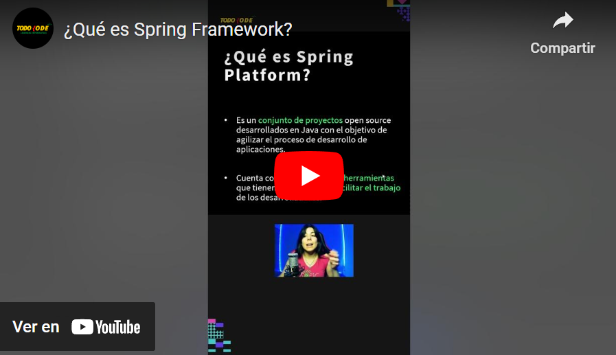
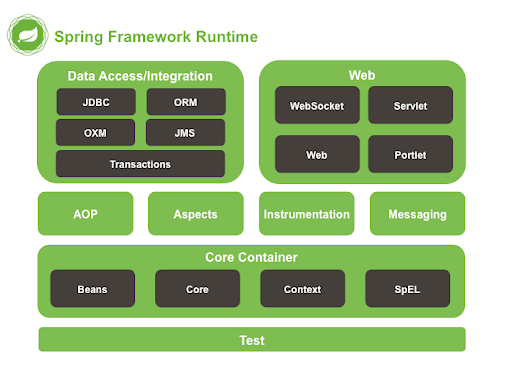
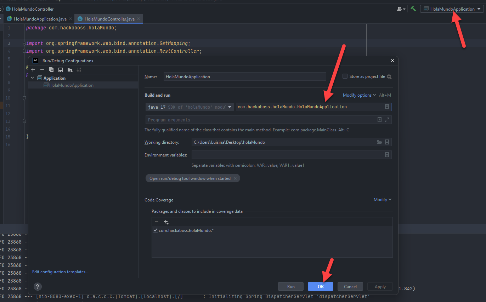

## Temas a tratar

En esta clase se abordarán las siguientes temáticas:

- **Conceptos importantes**
    - Librerías/bibliotecas vs frameworks
- **Introducción a Spring Framework**
    - Introducción a Spring Framework
    - Spring vs Spring Boot
    - Creación de un proyecto con Spring Boot + Initializr
- **Introducción a las APIs**
    - ¿Qué son las APIs?
    - Creación de una API sencilla con Spring Boot

---
## Librerías/Bibliotecas vs Frameworks

### ¿Qué son las librerías/bibliotecas?

Las librerías (o mejor llamadas como bibliotecas) son conjuntos de herramientas que solucionan necesidades específicas en un proyecto. Estas herramientas se pueden empaquetar para usarlas más adelante en situaciones similares.

Por lo general, las librerías son pedacitos de código que nos ayudan a resolver problemas concretos. Por ejemplo, pueden ser útiles para el manejo de fechas, ciertos aspectos de la interfaz gráfica o para conectar con bases de datos, entre otras cosas.

Existen dos tipos principales: las **librerías externas**, que suelen ser creadas por empresas o programadores expertos (como los conectores mysql para enlazar una aplicación Java con una base de datos), y las **librerías caseras** **o de utilidades**, que un programador desarrolla para reutilizar en su propio proyecto, como un gestor de fechas o funciones de búsqueda.


### ¿Qué son los frameworks?

Un framework es un conjunto de instrucciones y archivos que establecen la estructura y el enfoque para el desarrollo de un proyecto de software. Podríamos verlo como una especie de mapa o plan que nos facilita programar de manera ágil y simple.

Los frameworks, a diferencia de las librerías, ofrecen un entorno completo para trabajar. En muchos casos, no solo utilizan una, sino varias librerías o dependencias. Por lo general, estos sistemas se enfocan en un único lenguaje de programación.


### Comparativa entre Frameworks y Librerías

En el mundo del desarrollo de software, tanto las librerías como los frameworks son elementos fundamentales. La siguiente tabla comparativa destaca las diferencias esenciales entre ambos conceptos:

| Aspecto       | Librerías                                            | Frameworks                                           |
| ------------- | ---------------------------------------------------- | ---------------------------------------------------- |
| Definición    | Conjunto de funciones para resolver problemas        | Conjunto de pautas y archivos para desarrollo        |
| Funcionalidad | Resuelven necesidades específicas                    | Establecen la estructura y metodología               |
| Uso           | Pueden ser utilizadas individualmente                | Proporcionan un entorno completo de trabajo          |
| Complejidad   | Menos complejas, se enfocan en problemas específicos | Mayor complejidad, abarcan aspectos amplios          |
| Dependencias  | Pueden depender de otras librerías o utilidades      | Incluyen o utilizan múltiples librerías              |
| Enfoque       | Centradas en soluciones particulares                 | Se enfocan en lenguajes o tipos de desarrollo        |
| Ejemplos      | Manejo de fechas, interfaz gráfica, conexiones BD    | Django (Python), Angular (JavaScript), Laravel (PHP) |

A modo de resumen, podemos ver también un poco sus diferencias en la siguiente imagen:


Veamos estas diferencias un poco más en detalle en el siguiente video:

[](https://youtu.be/1gbdo1Nq-d8)

---

## Spring Framework

### ¿Qué es Spring Framework?

**Spring Framework** es un conjunto integral de herramientas y bibliotecas que facilitan el desarrollo de aplicaciones en Java. Es conocido por su enfoque en la creación de aplicaciones empresariales robustas y escalables.

Este framework ofrece una estructura modular que permite a los desarrolladores seleccionar y utilizar únicamente los módulos necesarios para sus proyectos, lo que brinda una flexibilidad considerable.


Una de las características destacadas de **Spring** es su contenedor de **inversión de control (IoC)**, que gestiona y organiza los componentes de una aplicación, permitiendo la creación y conexión de estos de manera sencilla. Además, Spring proporciona soporte para el desarrollo basado en aspectos (AOP), lo que permite modularizar aspectos transversales del sistema, como la seguridad o el registro, de forma separada del código principal.

Este framework se ha convertido en una pieza fundamental en el desarrollo de aplicaciones empresariales en Java debido a su facilidad de uso, su extensa documentación y su amplia comunidad de usuarios que brindan soporte continuo y soluciones a los desafíos comunes del desarrollo. Además, Spring se ha adaptado y evolucionado con el tiempo, manteniéndose al día con las tendencias y las mejores prácticas de desarrollo de software.

[](https://youtu.be/Oo-vujT74ek)

### Spring Platform

**Spring Platform e**s un conjunto de proyectos open source desarrollados en Java con el objetivo de agilizar el desarrollo de aplicaciones.

Cuenta con gran variedad de herramientas, que nos facilitan el trabajo desde el acceso a datos, infraestructura, creación de aplicaciones web, microservicios, etc.

La lista de todos estos proyectos se encuentra en la web oficial de Spring: [https://spring.io/projects](https://spring.io/projects)


### Core de Spring

Spring Framework, en su núcleo o core, representa el corazón de esta herramienta de desarrollo de aplicaciones empresariales en Java. Este core proporciona los fundamentos sobre los cuales se construye toda la estructura de Spring. Se compone de módulos esenciales que ofrecen características clave para simplificar y mejorar el desarrollo de software.

**Aspectos Clave del Core de Spring:**

1. **Inversión de Control (IoC) y Contenedor de Spring:** El core de Spring se centra en el principio de Inversión de Control, permitiendo al desarrollador delegar la gestión de objetos y sus dependencias al contenedor de Spring. Esto se logra a través de la configuración, donde los objetos son definidos y sus relaciones son gestionadas por el contenedor, lo que facilita la creación y la reutilización de componentes.
    
2. **Inyección de Dependencias:** Un aspecto central de la IoC es la inyección de dependencias, que permite conectar componentes de una aplicación sin que estos estén fuertemente acoplados. Spring se encarga de proporcionar estas dependencias a los objetos, lo que simplifica la configuración y flexibiliza la aplicación, facilitando la prueba unitaria y el cambio de implementaciones.
    
3. **Programación Orientada a Aspectos (AOP):** El core de Spring también abarca la programación orientada a aspectos. Esto permite separar las preocupaciones transversales a través de aspectos (como la seguridad, el registro o el manejo de transacciones) del código de la aplicación principal. Esta modularización ayuda a mejorar la modularidad y mantenibilidad del código.
    
4. **Módulos Fundamentales:** Dentro del core de Spring, se encuentran módulos esenciales como Spring Beans, que proporciona soporte para la configuración y la gestión de los objetos controlados por Spring; y Spring Context, que ofrece un contexto de aplicación, acceso a servicios y soporte para la internacionalización y la carga de recursos.



---

## Spring Boot

### ¿Qué es Spring Boot?

**Spring Boot** representa una expansión de Spring framework destinada a facilitar la generación veloz y sencilla de aplicaciones web ya preparadas para producción mediante el lema "solo ejecutar".

Este entorno demanda una configuración mínima y se enriquece con una amplia gama de proyectos provenientes de la Plataforma Spring y diversas librerías de terceros.

Para acceder a su documentación oficial, puedes visitar su sitio web en: [spring.io/projects/spring-boot](https://spring.io/projects/spring-boot)


#### **Características clave de Spring Boot:**

- **Arranque rápido:** Permite iniciar rápidamente un proyecto sin requerir una configuración compleja.
    
- **Configuración automática:** Proporciona configuraciones predeterminadas inteligentes basadas en las dependencias y el entorno.
    
- **Embedded Containers:** Ofrece contenedores integrados como Tomcat, Jetty o Undertow, lo que simplifica la implementación de la aplicación.
    
- **Actuadores y monitorización:** Incluye actuadores para administrar y supervisar la aplicación en tiempo de ejecución.
    

### Spring vs Spring Boot

A menudo, existe confusión entre los términos "**Spring**" y "**Spring Boot**". Esto se debe a que, si bien ambos están estrechamente relacionados en el ecosistema de Spring Framework, ofrecen funcionalidades y enfoques distintos.

Aunque ambos comparten la misma base, es esencial comprender sus diferencias y cómo se complementan entre sí para el desarrollo de aplicaciones en Java.


#### Diferencias entre Spring y Spring Boot

| Aspecto               | Spring                                                   | Spring Boot                                                                |
| --------------------- | -------------------------------------------------------- | -------------------------------------------------------------------------- |
| Enfoque principal     | Ofrece un amplio ecosistema para el desarrollo           | Simplifica la configuración con valores predeterminados                    |
| Configuración         | Requiere configuraciones más detalladas                  | Demanda una configuración mínima y automática                              |
| Complejidad           | Mayor flexibilidad pero con mayor complejidad            | Menos complejidad, centrado en la convención sobre la configuración        |
| Iniciación rápida     | Menos ágil, requiere configuraciones específicas         | Arranque rápido con mínima configuración                                   |
| Documentación         | Amplia, abarca múltiples aspectos de la plataforma       | Se enfoca en los aspectos esenciales de la creación rápida de aplicaciones |
| Proyectos y librerías | Se complementa con diversos proyectos Spring y librerías | Aprovecha una amplia gama de proyectos Spring y librerías de terceros      |
| Ejemplo de uso        | Desarrollo amplio y flexible de aplicaciones             | Creación rápida de aplicaciones web listas para producción                 |

---

## Creación de un proyecto con Spring Boot + Initializr

### ¿Qué es Initializr?

Initializr es una herramienta en línea que facilita la creación y configuración inicial de proyectos basados en Spring Boot. Esta herramienta ayuda a los desarrolladores a iniciar rápidamente nuevos proyectos proporcionando una interfaz web simple y amigable.

**Funcionalidades clave de Initializr:**

1. **Generación de Proyectos:** Initializr permite a los usuarios seleccionar las dependencias y configuraciones necesarias para su proyecto Spring Boot desde una lista predefinida. Esto incluye la elección del lenguaje de programación, la versión de Spring Boot, las dependencias (como bases de datos, seguridad, web, entre otras) y el sistema de compilación (como Maven o Gradle).
    
2. **Personalización de Proyectos:** Los usuarios tienen la opción de personalizar aún más su proyecto al agregar o eliminar dependencias según los requisitos específicos de su aplicación. Esto garantiza que los proyectos se ajusten exactamente a las necesidades del desarrollador.
    
3. **Descarga del Proyecto:** Una vez configurado el proyecto deseado, Initializr genera un archivo zip que contiene la estructura básica del proyecto Spring Boot con las dependencias seleccionadas. Este archivo se puede descargar y utilizar como punto de partida para el desarrollo de la aplicación.
    
4. **Integración con IDEs y Herramientas de Desarrollo:** Initializr se integra fácilmente con varios Entornos de Desarrollo Integrados (IDEs) y herramientas de desarrollo, lo que permite una transición fluida desde la configuración inicial hasta el desarrollo real del proyecto.
    

**Beneficios de Initializr:**

- **Inicio Rápido:** Permite iniciar rápidamente proyectos basados en Spring Boot sin la necesidad de configuraciones tediosas desde cero.
    
- **Personalización Sencilla:** Ofrece opciones para personalizar el proyecto según las necesidades específicas de la aplicación.
    
- **Estandarización:** Proporciona una estructura inicial estándar para proyectos Spring Boot, lo que ayuda a mantener una organización y estándares consistentes.
    

**Initializr** es una herramienta valiosa para agilizar y simplificar el proceso de configuración inicial de proyectos basados en **Spring Boot,** permitiendo a los desarrolladores comenzar rápidamente con sus aplicaciones.

Por si quedaran dudas, es la aplicación que vamos a utilizar para armar y configurar nuestros proyectos basados en Spring Boot 😉.

Para acceder a **Initializr**, debemos ingresar a: **_[https://start.spring.io/](https://start.spring.io/)_**


### ¿Cómo usar Initializr?

El uso de Initializr es sencillo, una vez dentro de la web únicamente seleccionamos la versión de Spring Boot que queramos utilizar, el gestor de dependencias que vayamos a utilizar (Maven en este caso), la metadata de nuestro proyecto y luego las dependencias iniciales necesarias junto con la versión de JDK (17 en este caso).

Una vez finalizada la configuración inicial, hacemos click en Generate y obtendremos un archivo .zip (comprimido) con nuestro proyecto base, lo descomprimimos y podemos levantarlo en el IDE que queramos.


#### Configuración base inicial

Veamos una configuración básica inicial, para ello vamos a elegir las siguientes dependencias y llevar a cabo las siguientes configuraciones:


**Spring Web** es la dependencia básica que necesitamos, mientras que **Dev Tools** y **Lombok** son dependencias complementarias que iremos aprendiendo más adelante para qué sirven.

Una vez realizada esta configuración, descargamos el proyecto, lo descomprimimos y lo levantamos en nuestro IDE. Si quieres descargar este mismo proyecto puedes hacerlo desde este [link](https://start.spring.io/#!type=maven-project&language=java&platformVersion=3.2.0&packaging=jar&jvmVersion=17&groupId=com.hackaboss&artifactId=holaMundo&name=holaMundo&description=Demo%20project%20for%20Spring%20Boot&packageName=com.hackaboss.holaMundo&dependencies=web,devtools,lombok).

Si todo sale correctamente deberíamos ver algo similar a esto:


Vamos a ejecutar ahora esta aplicación y, si todo sale bien obtendremos el siguiente mensaje de “error” al escribir en nuestro navegador [https://localhost:8080](https://localhost:8080)


Por el momento este error es CORRECTO que suceda, dado que aún no tenemos ninguna página/respuesta mapeada ante una solicitud get (que es lo que estamos haciendo al acceder a localhost). A medida que avancemos, iremos viendo cómo generar responses dependiendo del método con el que recibamos las requests.

---

## ¿Qué son las APIs?

Una **API** (_application programming interface_) es un conjunto de funciones y procedimientos (métodos) que se usa para diseñar e integrar el software de diferentes aplicaciones.

**REST (_Representational State Transfer_)** es un tipo de servicio que no posee estado. Es cualquier interfaz (interconexión) entre sistemas que use HTTP como protocolo para obtener datos o generar operaciones sobre los mismos en formatos como XML y JSON.

[](https://youtu.be/IwnIxk8DdHs)

### ¿Qué permite hacer una API-Rest?

- Las **API** representan un puente entre sistemas independientemente del lenguaje en el que estén programados.
    
- Su función radica en ofrecer servicios o aplicaciones específicas que pueden ser utilizadas simultáneamente por diversos usuarios.
    
- Una de sus funciones clave es simplificar el trabajo de los desarrolladores al permitirles reutilizar recursos y software existentes.
    
- Por ejemplo, al crear una tienda en línea, emplear APIs evitaría la necesidad de construir un sistema de pagos desde cero. En su lugar, podrías integrar sin complicaciones la API de un servicio de pagos ya establecido, como por ejemplo PayPal o cualquier pasarela de pagos.


---

## Creación de una API

Vamos a convertir nuestro proyecto **“holaMundo”** en una API de saludos. Para ello, crearemos una nueva clase llamada **“HolaMundoController”** que será nuestro controlador, esto basado en el **patrón MVC** (que veremos en mayor detalle más adelante 😉).

- Para indicar que esta clase es un controlador, agregaremos la annotation `@RestController`
    
- Dentro de la clase vamos a crear el método decirHola() que va a devolver un String que diga “Hola Mundo”.
    
- A este método lo vamos a mapear también con una annotation que será `@GetMapping` (veremos más adelante en profundidad esta annotation y para qué sirve, como adelanto, te contamos que sirve para atender solicitudes mediante el método GET 😀)

Si todo sale bien, deberíamos de tener algo similar a esto:

```java
package com.hackaboss.holaMundo;

import org.springframework.web.bind.annotation.GetMapping;
import org.springframework.web.bind.annotation.RestController;

@RestController
public class HolaMundoController {

   @GetMapping
   public String decirHola () {

       return "Hola Mundo";
   }

}
```

Con todo esto listo, deberíamos ser capaces de ejecutar nuestra api y recibir como respuesta el mensaje “Hola Mundo”, tal como podemos ver en la siguiente imagen:


>💡Tip a tener en cuenta
>- Para poder ejecutar de forma automática nuestras aplicaciones hechas con Spring Boot debemos configurar y especificar cuál es nuestra clase Main.
>- Esto lo debemos hacer desde las configuraciones de nuestro IDE, en Intellij lo logramos de la siguiente manera:
>	- Dentro de nuestro proyecto vamos arriba a la derecha (al lado del play verde de ejecución) donde veremos el nombre de nuestra aplicación “HolaMundoApplication”.
>	- Hacemos click allí y luego en“Edit Configurations”
>	- Se nos abrirá una nueva pestaña donde debemos establecer cuál es nuestra clase main.
>	- Una vez seleccionada, damos click a ok y ¡Listo! Todo debidamente configurado.




