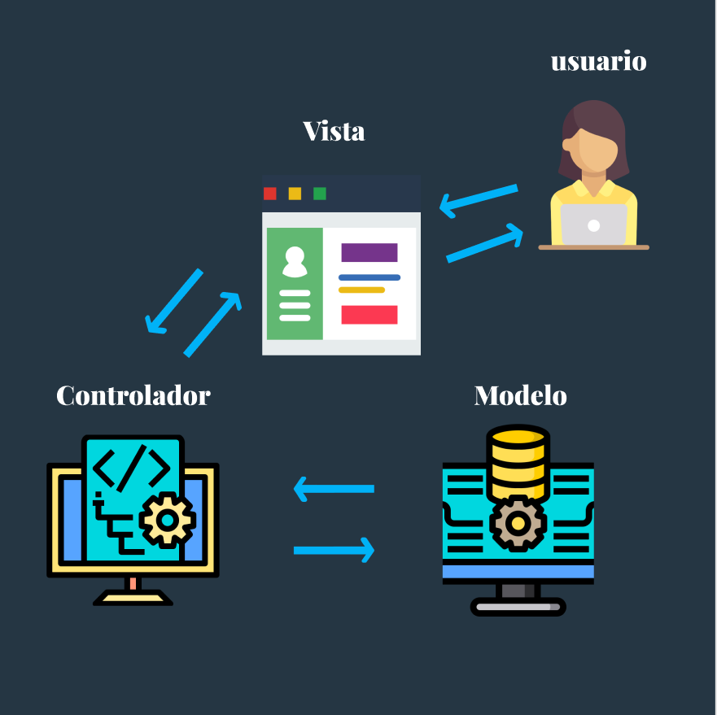

## Temas a tratar

En esta clase se abordarán las siguientes temáticas:

**Introducción a JSON**
- **¿Qué es JSON?**
    - Sintaxis básica
    - Principales usos
- **Patrón MVC (Modelo Vista Controlador)**
- **Anotaciones de Métodos HTTP**
    - @GetMapping
    - Parámetros mediante: @PathVariable y @RequestParam

---

## ¿Qué es JSON?

**JSON**, acrónimo de "**JavaScript Object Notation**" (Notación de Objetos de JavaScript), es un formato ligero de intercambio de datos.

Es utilizado para representar datos estructurados de una manera legible tanto para humanos como para máquinas. Originalmente, se desarrolló como parte del lenguaje de programación JavaScript, pero actualmente es independiente del lenguaje y se utiliza en una amplia gama de aplicaciones debido a su simplicidad y facilidad de comprensión.

[](https://youtu.be/RhxOTqFbI5Q)

### **Características Clave de JSON**

1. **Legible para Humanos:** Su estructura se asemeja a la notación de objetos en JavaScript, lo que lo hace fácil de leer y entender para los programadores.
    
2. **Ligero:** Es un formato ligero, lo que significa que no agrega una carga significativa a los datos, facilitando su transferencia a través de redes.
    
3. **Independiente del Lenguaje:** Puede ser utilizado con cualquier lenguaje de programación, lo que lo hace versátil y compatible con diversas aplicaciones y sistemas.


### **Principales Usos de JSON**

1. **Comunicación entre Servidor y Cliente:** Es ampliamente utilizado en aplicaciones web y móviles para intercambiar datos entre el servidor y el cliente. Las respuestas de las API suelen estar en formato JSON.
    
2. **Almacenamiento y Transmisión de Datos:** Se usa para almacenar datos estructurados, como configuraciones, registros y metadatos, y para transmitirlos entre sistemas.
    
3. **Configuración y Serialización de Objetos:** Debido a su capacidad para representar datos complejos, se utiliza en la serialización de objetos, facilitando el almacenamiento y transmisión de objetos complejos en diferentes aplicaciones.
    
4. **Intercambio de Datos en Aplicaciones Web:** Es fundamental en el intercambio de datos entre diferentes partes de aplicaciones web, desde el front-end hasta las API del servidor.
    

### Sintaxis de JSON

**JSON** tiene dos elementos centrales:

- **Los objetos:** Están representados mediante llaves, su apertura indica el comienzo de la estructura de un objeto y su cierre el final.
    
- **Sus valores intrínsecos:** Los mismos se representan mediante claves (o _keys_) y valores (o _value_).
    
    - Las **claves** deben ser cadenas de caracteres y representan el “nombre” del valor.
        
    - Los **valores** son tipos de datos soportados por JSON.
        
Las claves y valores se separan entre sí mediante “**:**”

En caso de necesitar agregar más claves y valores, se separan entre sí mediante “

**Ejemplo:**

```json
{  
   “clave” : “valor”,
   “clave2” : “valor2”,
   “clave3” : “valor3”
}
```

#### Ejemplo de JSON

Aquí tienes un ejemplo de cómo se vería un objeto JSON que representa información sobre **Gokú**, el famoso personaje de **Dragon Ball**:

```json
{
  "nombre": "Gokú",
  "edad": 35,
  "ocupacion": "Luchador",
  "planeta_origen": "Tierra",
  "familia": {
    "esposa": "Milk",
    "hijos": ["Gohan", "Goten"]
  },
  "habilidades": ["Kamehameha", "Genkidama", "Teletransportación"]
}
```


#### Ejemplo más complejo de JSON

Aquí tienes un ejemplo, un poco más complejo de JSON con personajes de Harry Potter:

```json
{
  "nombre": "Gryffindor",
  "colores": ["Amarillo", "Bordó"],
  "integrantes": [
    {
      "nombre": "Harry",
      "apellido": "Potter"
    },
    {
      "nombre": "Hermione",
      "apellido": "Granger"
    },
    {
      "nombre": "Ron",
      "apellido": "Weasley"
    }
  ]
}
```

En este caso:

- **"nombre"**: Representa el nombre del grupo, en este caso, "Gryffindor".
    
- **"colores"**: Es un arreglo que contiene los colores asociados al grupo, siendo "Amarillo" y "Bordó" sus colores.
    
- **"integrantes"**: Es un arreglo que contiene objetos representando a los miembros del grupo Gryffindor. Cada objeto dentro de este arreglo tiene dos atributos: "nombre" y "apellido". En este caso, se incluyen tres integrantes: Harry Potter, Hermione Granger y Ron Weasley, cada uno con su respectivo nombre y apellido.


### JSON para responses

En el contexto de Spring Boot y las APIs, JSON es un formato de respuesta común utilizado para transmitir datos desde el servidor al cliente. Spring Boot, al ser un framework flexible y poderoso, facilita la generación de respuestas JSON para las API de manera sencilla.

A continuación veremos en mayor detalle el uso de JSON para las respuestas de las APIs en Spring Boot:

1. **Serialización Automática:** Cuando construyes una API en Spring Boot y devuelves un objeto como respuesta desde un controlador (`@RestController`), Spring Boot automáticamente serializa ese objeto a JSON antes de enviarlo como respuesta al cliente. Esto se logra con la ayuda de bibliotecas como Jackson, que Spring Boot incorpora por defecto.
    
2. **Anotaciones para Controladores:** Al anotar tus controladores o métodos con `@RestController` o `@Controller`, y al devolver objetos simples o complejos desde esos métodos, Spring Boot se encarga de convertir esos objetos en respuestas JSON.
    
3. **Personalización de Respuestas JSON:** Puedes personalizar cómo se serializan tus objetos a JSON utilizando anotaciones como `@JsonProperty` para nombrar propiedades, `@JsonIgnore` para excluir propiedades, y otras anotaciones de Jackson según sea necesario.
    
4. **Manejo de Errores:** En caso de errores, Spring Boot también es capaz de devolver mensajes de error en formato JSON, lo que facilita su interpretación por parte del cliente.
    
5. **Soporte para Conversión de Tipos:** Spring Boot maneja automáticamente la conversión de tipos de datos complejos, como listas, mapas, y objetos anidados, a su representación en JSON y viceversa.
    
En resumen, **JSON** se utiliza ampliamente en Spring Boot para las respuestas de las APIs debido a su legibilidad, facilidad de uso y soporte incorporado en el ecosistema de Spring, permitiendo una comunicación efectiva entre el servidor y el cliente a través del **Protocolo HTTP**.


### Practiquemos JSON

A continuación te proponemos realizar un ejercicio para poner en práctica todo lo aprendido con JSON. En él deberás:

- Crear un objeto JSON que represente la información básica de Pikachu, el famoso personaje de Pokémon.
    
    - Define las características básicas de Pikachu. Por ejemplo, su nombre, tipo, habilidades, características físicas, entre otros detalles relevantes.
        
    - Incluye campos como "nombre", "tipo", "habilidades", "color", "altura", "peso" u otros atributos que consideres importantes para describir a Pikachu.
        
    - Asegúrate de seguir la estructura básica de JSON (pares clave-valor separados por comas, objetos dentro de llaves `{}`, arreglos dentro de corchetes `[]`, etc.).
        

#### Resolución

A continuación te proponemos una posible resolución:

```json
{
  "nombre": "Pikachu",
  "tipo": "Eléctrico",
  "habilidades": ["Impactrueno", "Ataque Rápido", "Rayo"],
  "color": "Amarillo",
  "altura": "0.4 m",
  "peso": "6 kg",
  "descripcion": "Pikachu es un Pokémon eléctrico muy conocido por su carisma y su cola en forma de rayo."
}
```


---

## Patrón MVC

El **patrón** **Modelo-Vista-Controlador (MVC)** es un enfoque de diseño utilizado comúnmente en aplicaciones Java y otros lenguajes de programación para separar la lógica de la aplicación en tres componentes principales: **Modelo, Vista y Controlador**.



1. **Modelo (Model):**
    
    - El **Modelo** representa los datos y la lógica de la aplicación. En Java, los modelos son clases que encapsulan la estructura de datos y la funcionalidad relacionada con esos datos, como métodos para acceder, modificar o procesar la información. Por ejemplo, una clase `Usuario` podría ser un modelo que contiene atributos como nombre, edad, correo electrónico, etc., junto con métodos para obtener y establecer estos atributos.
        
2. **Vista (View):**
    
    - La **Vista** se encarga de la presentación de los datos al usuario. En Java, las vistas son las interfaces gráficas o las páginas web que muestran la información al usuario y recopilan la interacción del usuario. Las vistas no contienen lógica de negocio, sino que muestran los datos proporcionados por el Modelo y envían las interacciones del usuario al Controlador. Por ejemplo, en una aplicación Java con GUI, la vista podría ser una ventana que muestra los datos de un usuario en etiquetas, campos de texto, botones, etc.
        
3. **Controlador (Controller):**
    
    - El **Controlador** actúa como intermediario entre la Vista y el Modelo. En Java, el Controlador generalmente consiste en clases que manejan las interacciones del usuario y actualizan el Modelo en consecuencia. Recibe las solicitudes del usuario desde la Vista, interpreta esas solicitudes y realiza las operaciones necesarias en el Modelo. Por ejemplo, en una aplicación web Java, el Controlador podría ser un servlet que recibe las solicitudes HTTP, interactúa con el Modelo para obtener o actualizar datos y luego devuelve una respuesta apropiada a la Vista.
        

### Flujo típico de MVC en Java

El flujo típico en el **patrón MVC** en **Java** sería:

1. El usuario interactúa con la Vista (interfaz gráfica, página web).
    
2. La Vista envía la solicitud al Controlador.
    
3. El Controlador interpreta la solicitud, interactúa con el Modelo si es necesario y actualiza los datos.
    
4. El Controlador devuelve una respuesta adecuada a la Vista.
    
5. La Vista actualiza la interfaz para reflejar los cambios en los datos.
    

El **patrón MVC** permite una separación clara de preocupaciones, lo que hace que la aplicación sea más mantenible, escalable y fácil de entender, ya que cada componente tiene una responsabilidad específica dentro del flujo de la aplicación.

[](https://youtu.be/zhSDjntidws)
>💡El MANEJO del Patrón MVC será super importante en nuestra carrera como desarrolladores Java para asegurar la calidad de nuestro código y el desacople de responsabilidades entre cada una de las partes de nuestra aplicación, por lo que es sumamente indispensable que lo aprendamos a implementar correctamente.

---

## @GetMapping

`@GetMapping` es una anotación en el framework Spring MVC y Spring Boot, que se utiliza para mapear peticiones HTTP GET a métodos específicos en controladores de Spring.

En **Java**, particularmente en el contexto de **Spring MVC**, cuando se construyen aplicaciones web, las solicitudes HTTP (GET, POST, PUT, DELETE, etc.) se manejan mediante métodos dentro de controladores. Estos métodos manejan las solicitudes entrantes y devuelven una respuesta apropiada al cliente.

**Por ejemplo:**

```java
import org.springframework.web.bind.annotation.GetMapping;
import org.springframework.web.bind.annotation.RestController;

@RestController
public class ProductoController {

    @GetMapping("/productos") // Esta anotación indica que este método manejará las solicitudes GET a la URL /productos
    public String obtenerProductos() {
        // Supongamos que aquí obtienes los productos de una base de datos o servicio
        // En este ejemplo, simplemente se devuelve una cadena con información sobre los productos
        return "Lista de productos: Product A, Product B, Product C";
    }
}
```

En este caso:

- `@RestController` indica que la clase `ProductoController` es un controlador de Spring para manejar solicitudes HTTP.
    
- `@GetMapping("/productos")` es una anotación que mapea las peticiones GET a la URL `/productos` al método `obtenerProductos()`.
    
- `obtenerProductos()` es el método que maneja la solicitud GET. Aquí podrías realizar operaciones como acceder a una base de datos para obtener una lista real de productos y devolverla como respuesta.
    

Cuando se realiza una solicitud GET a la URL `/productos`, el método `obtenerProductos()` se ejecuta y, en este caso, devolverá una cadena con una lista de productos.

>💡Recuerda que al personalizar los paths (URLs) mediante la indicación entre “()”, hacemos que **SI o SI** sea necesario ingresar ese path para ir a dicho recurso. Por otro lado, si no especificamos path, Spring Boot tomará por defecto el directorio raíz.

---

## Parámetros en APIs

`@PathVariable` y `@RequestParam` son anotaciones en Spring MVC (y Spring Boot) que permiten recibir datos proporcionados por el cliente en las solicitudes HTTP, pero que se utilizan de manera diferente dependiendo del contexto.

### @PathVariable

`@PathVariable` se utiliza para extraer datos de la URL de la solicitud y se vincula a un parámetro en un método del controlador. Se utiliza para obtener valores de variables presentes en la URL de la solicitud.

**Por ejemplo:**

Supongamos que tienes una URL como `/usuarios/{id}`, donde `{id}` es el identificador de un usuario. Puedes usar `@PathVariable` para capturar ese `id` y utilizarlo en tu método del controlador:

**Por ejemplo:**

```java
@GetMapping("/usuarios/{id}")
public String obtenerUsuarioPorId(@PathVariable Long id) {
    // Utiliza el id recibido para obtener el usuario con ese identificador
    return "Detalles del usuario con ID: " + id;
}
```

En este ejemplo, la anotación `@PathVariable` vincula el parámetro `id` del método `obtenerUsuarioPorId()` al valor presente en la URL después de `/usuarios/`.


### @RequestParam

`@RequestParam` se utiliza para recibir datos de los parámetros de consulta (_query parameters_) en una solicitud HTTP GET o POST. Estos parámetros se envían como parte de la URL después del símbolo `?`.

**Por ejemplo:**

Supongamos que tienes una URL como `/productos?categoria=electronicos`, donde `categoria` es un parámetro de consulta. Puedes usar `@RequestParam` para obtener el valor de ese parámetro:

```java
@GetMapping("/productos")
public String obtenerProductosPorCategoria(@RequestParam String categoria) {
    // Utiliza el parámetro 'categoria' recibido para buscar productos de esa categoría
    return "Lista de productos de la categoría: " + categoria;
}
```

En este ejemplo, la anotación `@RequestParam` vincula el parámetro `categoria` del método `obtenerProductosPorCategoria()` al valor proporcionado en la URL como `?categoria=electronicos`.


### ¿Cuándo elegir @PathVariable o @RequestParam?

La elección entre `@PathVariable` y `@RequestParam` depende de la forma en que los parámetros se envían en las solicitudes HTTP y la naturaleza de los datos que se están manipulando en tu aplicación.

Aquí te dejamos algunas consideraciones que pueden ayudarte a decidir cuándo utilizar cada uno:

#### **Cuándo usar @PathVariable**

1. **Cuando los parámetros están incluidos en la URL:** `@PathVariable` es útil cuando los parámetros están incrustados en la URL misma, como segmentos de la ruta. Por ejemplo, `/usuarios/{id}` o `/productos/{codigo}`.
    
2. **Para identificadores únicos o identificadores de recursos:** Si necesitas acceder a recursos específicos (por ejemplo, un usuario, producto, publicación, etc.) utilizando un identificador único que forma parte de la URL, `@PathVariable` es una buena opción
    
3. **Para rutas más específicas y significativas:** Si deseas una URL más clara y descriptiva que represente un recurso en particular, `@PathVariable` puede ayudar a estructurar la URL de manera más significativa y legible.
    

#### **Cuándo usar @RequestParam:**

1. **Cuando los parámetros son opcionales o están presentes en la URL como parámetros de consulta:** Si los parámetros son opcionales o se envían como parámetros de consulta en la URL (después del símbolo `?`), `@RequestParam` es apropiado. Por ejemplo, `/productos?categoria=electronicos`.
    
2. **Para filtrar o buscar datos en base a múltiples criterios:** Si estás buscando filtrar datos o realizar búsquedas basadas en varios parámetros, utilizar `@RequestParam` te permite recibir esos parámetros de manera más flexible.
    
3. **Cuando los parámetros no son parte de la ruta directa:** Si los parámetros no están directamente relacionados con la ruta del recurso, sino que son más bien criterios de búsqueda, paginación, filtros u otros datos no esenciales para identificar el recurso, es mejor utilizar `@RequestParam`.
    

#### En Resumen

| Características                    | @PathVariable                                                                          | @RequestParam                                                                                        |
| ---------------------------------- | -------------------------------------------------------------------------------------- | ---------------------------------------------------------------------------------------------------- |
| Uso                                | Extrae datos de la URL como segmentos de ruta.                                         | Obtiene datos de parámetros de consulta en la URL.                                                   |
| Sintaxis                           | @GetMapping("/ruta/{variable}")                                                        | @GetMapping("/ruta") con @RequestParam para el parámetro                                             |
| Ubicación en la URL                | Segmentos de ruta.                                                                     | Después del símbolo ? como parámetros de consulta.                                                   |
| Identificadores únicos             | Útil para identificar recursos específicos por un ID en la URL.                        | No necesariamente para identificadores únicos.                                                       |
| Rutas más significativas           | Ayuda a estructurar URL más descriptivas y significativas.                             | No influye en la estructura de la URL.                                                               |
| Parámetros opcionales              | No es ideal para parámetros opcionales.                                                | Útil para parámetros opcionales o filtros.                                                           |
| Múltiples criterios de búsqueda    | No es tan flexible para manejar múltiples parámetros.                                  | Permite recibir varios parámetros de consulta en una solicitud.                                      |
| Ejemplo de sintaxis en Java/Spring | @GetMapping("/usuarios/{id}") public String obtenerUsuarioPorId(@PathVariable Long id) | @GetMapping("/productos") public String obtenerProductosPorCategoria(@RequestParam String categoria) |

---

## Ejercicios propuestos

### Ejercicio Nº 1

- Llevar a cabo una **API** mediante **SpringBoot** donde a partir de que se envíe el nombre de una persona mediante URL, la API responda un “Hola Mundo” + el nombre que se envío como parámetro.
    
    - Agregar un segundo parámetro edad y hacer un endpoint que si recibe nombre + edad muestre el “Hola Mundo” + nombre + edad.
        
    - Agregar un tercer parámetro que sea profesión y crear otro endpoint que si recibe nombre + edad + profesión muestre “Hola mundo” + nombre + edad + profesión.
        

[Descargar Resolución](./resources/1-ResolucionNombresParametros.zip)

**Pruebas que puedes realizar para probar la API**

- `/saludar?nombre=Juan` devolverá "Hola Mundo Juan".
    
- `/saludarConEdad?nombre=María&edad=25` devolverá "Hola Mundo María tienes 25 años".
    
- `/saludarConProfesion?nombre=Pedro&edad=30&profesion=Ingeniero` devolverá "Hola Mundo Pedro tienes 30 años y eres Ingeniero".
    

### Ejercicio Nº 2

- **Ejercicio desafiante y de mayor complejidad:**
    
    Realizar una Api que sea capaz de convertir un número decimal de 1 a 1000 en su equivalente en números romanos. Para ello se deberá enviar como parámetro el número y se obtendrá como respuesta su equivalente en números romanos. Como recordatorio tener en cuenta la siguiente tabla de referencia de valores:    

| Número Decimal | Número Romano |
| -------------- | ------------- |
| 1              | I             |
| 5              | V             |
| 10             | X             |
| 50             | L             |
| 100            | C             |
| 1000           | M             |

**Ejemplo:** Si una persona envía el número 7 como parámetro, la respuesta debería de ser VII. Si envía el número 35 debería ser XXXV y así sucesivamente.

**[Descargar Resolución](./resources/2-ResolucionNumerosRomanos.zip)**

