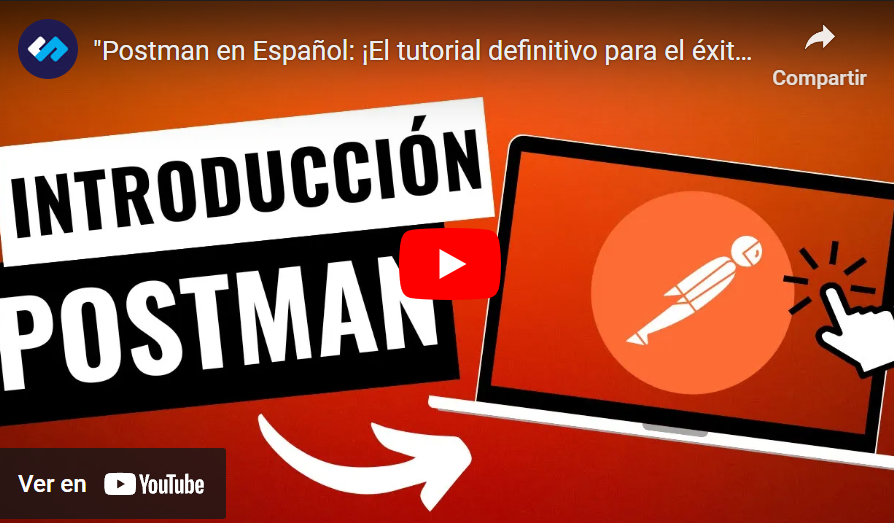

## Temas a tratar

En esta clase se abordarán las siguientes temáticas:

**Incorporación de nuevos conceptos**
- Endpoint
- @RequestMapping

**Anotaciones de Métodos HTTP**
- @PostMapping
- @RequestBody
- @ResponseBody
- ResponseEntity

---

## Incorporación de conceptos

### Endpoint

Un endpoint, en el contexto de las aplicaciones web y las APIs, es un punto de acceso o una URL específica que un cliente puede solicitar para realizar una operación o acceder a recursos en un servidor. Esencialmente, representa un extremo de comunicación a través del cual los clientes pueden interactuar con una aplicación o un servicio.

Cada endpoint se identifica por una dirección URL específica. Por ejemplo, `/usuarios`, `/productos`, `/saludar`, etc.,

Los endpoints pueden admitir diferentes métodos HTTP, como GET, POST, PUT, DELETE, entre otros, para realizar diferentes operaciones en los recursos del servidor.

Cada endpoint puede estar asociado con operaciones específicas que se realizan en el servidor, como obtener datos, crear, actualizar o eliminar recursos.

#### **Ejemplo:**

En una API de una tienda en línea:

- `/productos` podría ser un endpoint para obtener la lista de productos.
    
- `/usuarios` podría ser un endpoint para manejar operaciones relacionadas con los usuarios, como crear un nuevo usuario (`POST /usuarios`), obtener información de un usuario específico (`GET /usuarios/{id}`), actualizar los datos de un usuario (`PUT /usuarios/{id}`), eliminar un usuario (`DELETE /usuarios/{id}`), etc.
    
- `/realizar-compra` podría ser un endpoint para realizar una compra, donde se envían los detalles de la compra a través de una solicitud POST.

[](https://youtu.be/M7-2g1jeocc)

### @RequestMapping

`@RequestMapping` es una anotación de Spring que se utiliza para mapear las solicitudes HTTP a métodos específicos dentro de un controlador en una aplicación web desarrollada con Spring MVC o Spring Boot.

Permite especificar la URL o patrón de URL que el método del controlador manejará. Puede utilizarse a nivel de clase o a nivel de método.

Además, permite especificar los métodos HTTP (GET, POST, PUT, DELETE, etc.) que el método del controlador podrá manejar.

Por otro lado, permite la inclusión de variables en la URL (mediante `{}`) y el manejo de parámetros de solicitud.

En pocas palabras, **@RequestMapping** nos permite personalizar la URL o path que queremos que tengan nuestros endpoints. Por ejemplo:

```java
@RestController
@RequestMapping("/api")
public class EjemploController {

    @GetMapping("/ejemplo")
    public String ejemplo() {
        return "¡Ejemplo de RequestMapping!";
    }
}
```

En este caso, `@RequestMapping("/api")` a nivel de clase indica que todos los métodos dentro de `EjemploController` manejarán solicitudes que comiencen con `/api`.


#### Mapeo de Múltiples URLs

También es posible que podamos mapear una clase controladora a varias posibilidades de path o url, un ejemplo podría ser:

```java
@RestController
@RequestMapping(value = {"/usuarios", "/clientes"}, method = {RequestMethod.GET, RequestMethod.POST})
public class UserController {

    // Métodos para manejar solicitudes GET y POST a /usuarios o /clientes
}
```

---

## @PostMapping

`@PostMapping` es una anotación en Spring (y Spring Boot) que se utiliza para mapear peticiones HTTP de tipo POST a métodos específicos en controladores.

En el contexto de una aplicación web en Java con Spring, cuando se trabaja con formularios HTML o se envían datos al servidor a través de una solicitud POST, se utiliza `@PostMapping` para manejar esa solicitud y procesar los datos enviados.

#### **Ejemplo:**

Supongamos que tienes una aplicación web donde los usuarios pueden registrarse a través de un formulario. Utilizaremos `@PostMapping` para manejar la solicitud de registro de un nuevo usuario.

```java
import org.springframework.beans.factory.annotation.Autowired;
import org.springframework.stereotype.Controller;
import org.springframework.web.bind.annotation.PostMapping;
import org.springframework.web.bind.annotation.RequestParam;
import org.springframework.web.servlet.ModelAndView;

@Controller
public class RegistroUsuarioController {

    private final UsuarioService usuarioService;

    @Autowired
    public RegistroUsuarioController(UsuarioService usuarioService) {
        this.usuarioService = usuarioService;
    }

    @PostMapping("/registro")
    public ModelAndView registrarNuevoUsuario(@RequestParam("nombre") String nombre,
                                             @RequestParam("email") String email,
                                             @RequestParam("contrasena") String contrasena) {
        // Crear un nuevo usuario con los datos proporcionados
        Usuario nuevoUsuario = new Usuario(nombre, email, contrasena);
        
        // Guardar el nuevo usuario en la base de datos a través del servicio de usuarios
        usuarioService.registrarUsuario(nuevoUsuario);

        // Redirigir a una página de éxito o a otra vista
        ModelAndView modelAndView = new ModelAndView("exito-registro");
        modelAndView.addObject("nombreUsuario", nombre);
        return modelAndView;
    }
}
```

En este caso:

- `@PostMapping("/registro")` indica que el método `registrarNuevoUsuario()` manejará las solicitudes POST enviadas a la URL `/registro`.
    
- `@RequestParam` se utiliza para obtener los datos enviados desde el formulario HTML (como `nombre`, `email` y `contrasena`).
    
- Se crea un nuevo objeto `Usuario` con los datos proporcionados y se utiliza un servicio (`UsuarioService`) para guardar este usuario en la base de datos.
    

Cuando se trabaja con el método `@PostMapping`, es común recibir datos del cliente que se envían n el cuerpo (body) de la solicitud HTTP POST. El cuerpo de la solicitud puede contener datos en diferentes formatos, como JSON, XML o datos de un formulario HTML codificados en URL, es allí donde entra en juego `@RequestBody`.

---

## @RequestBody

La anotación `@RequestBody` se utiliza para vincular el cuerpo de la solicitud HTTP con un objeto de Java en el controlador. Se utiliza para obtener datos enviados desde el cliente y convertirlos automáticamente en un objeto Java.

#### **Ejemplo:**

Supongamos que se recibe una solicitud POST con datos en formato JSON para crear un nuevo objeto `Producto` en una aplicación web:

```java
import org.springframework.web.bind.annotation.PostMapping;
import org.springframework.web.bind.annotation.RequestBody;
import org.springframework.web.bind.annotation.RestController;

@RestController
public class ProductoController {

    @PostMapping("/productos")
    public String crearProducto(@RequestBody Producto nuevoProducto) {
        // Realizar alguna lógica con el nuevo producto, como guardarlo en una base de datos
        // nuevoProducto contiene los datos enviados desde el cliente en formato JSON

        return "Producto creado: " + nuevoProducto.getNombre();
    }
}
```

- En este ejemplo, `@PostMapping("/productos")` indica que el método `crearProducto()` manejará las solicitudes POST enviadas a la URL `/productos`.
    
- `@RequestBody` se utiliza para indicar que el objeto `Producto` se debe crear a partir del cuerpo de la solicitud.
    
- `Producto` es una clase Java que representa la estructura de los datos enviados desde el cliente (por ejemplo, con propiedades como `nombre`, `precio`, etc.).
    

Un ejemplo del JSON que recibiría en este caso el Post podría ser:

```json
{
  "nombre": "Samsung S23 Ultra",
  "precio": 1299.99,
  "descripcion": "Teléfono móvil de alta gama con características avanzadas."
}
```

Este JSON Java lo traduciría a un objeto de tipo Producto mediante **@RequestBody** y **@PostMapping**

---

## @ResponseBody

Así como podemos manejar las requests (solicitudes) y sus cuerpos/bodies, podemos hacer lo mismo con las responses (respuestas).

`@ResponseBody` es una anotación en Spring que se utiliza en métodos de controlador para indicar que el valor devuelto por ese método debe ser usado directamente como el cuerpo de la respuesta HTTP.

- Anotar un método con `@ResponseBody` indica que el objeto devuelto por ese método debe ser serializado directamente al cuerpo de la respuesta HTTP, sin pasar por la resolución de vistas.
    
- Es útil para devolver datos en formato JSON, XML u otros formatos directamente al cliente sin la necesidad de una vista.
    

#### Ejemplo

Supongamos que se desea devolver un objeto de tipo `Persona` como JSON en la respuesta:

```java
import org.springframework.web.bind.annotation.GetMapping;
import org.springframework.web.bind.annotation.ResponseBody;
import org.springframework.web.bind.annotation.RestController;

@RestController
public class PersonaController {

    @GetMapping("/persona")
    public @ResponseBody Persona obtenerPersona() {
        Persona persona = new Persona("Juan", 30);
        return persona;
    }
}
```

- En este ejemplo, `@GetMapping("/persona")` indica que el método `obtenerPersona()` manejará las solicitudes GET enviadas a la URL `/persona`.
    
- La anotación `@ResponseBody` se coloca antes del método `obtenerPersona()`, indicando que el objeto `Persona` devuelto por este método debe ser utilizado directamente como el cuerpo de la respuesta HTTP.
    
- El objeto `Persona` es devuelto y automáticamente serializado como JSON en la respuesta HTTP.
    

Esto significa que cuando se realice una solicitud GET a `/persona`, el servidor responderá con un JSON que represente al objeto `Persona` devuelto por el método `obtenerPersona()`.

---

## ResponseEntity

`ResponseEntity` es una clase en Spring que representa toda la respuesta HTTP: el cuerpo, el encabezado y el código de estado. Proporciona flexibilidad para definir la respuesta HTTP completa que se enviará al cliente.

Recordemos que una respuesta HTTP cuenta con un cuerpo (body), un encabezado o cabecera y un status code o código de estado.

**ResponseEntity** nos permite manipular sus valores de la manera en que queramos para luego brindar la respuesta necesaria.

Podríamos modificar cada parte por ejemplo para:

- **Cuerpo de la respuesta:** Puede contener cualquier tipo de datos que se deseen enviar al cliente, como cadenas, objetos, listas, etc.
    
- **Encabezados HTTP:** Permite agregar encabezados personalizados a la respuesta, como `Content-Type`, `Location`, `Cache-Control`, etc.
    
- **Código de estado HTTP:** Se puede establecer el código de estado HTTP de la respuesta (por ejemplo, 200, 404, 500) para indicar el estado de la solicitud.
    

💡**IMPORTANTE:** Recuerda que ResponseEntity NO LLEVA @. Esto se debe a que NO ES UNA ANNOTATION sino que se trata de una CLASE propia de Spring/SpringBoot.

---

## Postman

Ya hemos visto como generar solicitudes http de tipo **GET** mediante el navegador, cómo podemos obtener respuesta a esas solicitudes en formato **JSON** pero, tenemos un detalle más que debemos tener en cuenta, y es el hecho que POR DEFECTO, con el navegador, solo podemos hacer solicitudes de tipo **GET**… ¿Qué pasa si queremos testear/probar los métodos Post, o Put, etc de nuestros endpoints en nuestras **APIs**? ¿Cómo lo hacemos?

Para estos casos, si bien existen diversas herramientas, la más conocida y confiable es **Postman**.

**Postman** es una plataforma integral diseñada para simplificar y agilizar el desarrollo, prueba y documentación de APIs.

Actúa como un **cliente HTTP** completo, permitiendo a los desarrolladores enviar diversas solicitudes, configurar encabezados y cuerpos de solicitud, así como ejecutar pruebas automatizadas.

Su utilidad se extiende a la organización de solicitudes en colecciones lógicas, la generación de documentación detallada y la facilitación de la colaboración y sincronización entre equipos, convirtiéndose en una herramienta esencial para equipos de desarrollo centrados en APIs.


### Instalación de Postman

Para poder probar nuestras APIs debemos tener Postman instalado, por lo que a continuación te presentamos un video explicativo de paso a paso sobre cómo descargar su versión oficial, cómo instalarlo y cómo configurarlo por primera vez:

[](https://youtu.be/laZv3I9XN0w)
Al mismo tiempo, para entender su funcionamiento básico, te dejamos a continuación un video corto explicativo:

[](https://youtu.be/qsejysrhJiU)

---

## Ejercicios

### **Sistema de Gestión de Pedidos de Comida**

Estamos desarrollando un sistema para gestionar pedidos de comida en un restaurante. El objetivo es crear una API RESTful utilizando Spring Boot que permita a los clientes realizar pedidos, agregar nuevos platos al menú y verificar el estado de un pedido.

Para esto se solicita implementar lo siguientes endpoints:

1. **GET /menu:** Devuelve la lista completa de platos disponibles en el menú.
    
2. **GET /pedido/{id}:** Devuelve la información detallada de un pedido específico por su ID.
    
3. **POST /pedido:** Permite a un cliente realizar un nuevo pedido.
    
4. **POST /menu/agregar:** Permite agregar un nuevo plato al menú.
    

>💡**Nota:** Utilizar como base de datos una Collection a elección para evitar todavía la configuración de Bases de Datos.

Una vez creados todos los endpoints, realizar pruebas de cada uno de ellos mediante Postman. Una vez finalizadas, exportar la “colección” de Postman y guardarla.

**[Descargar Resolución](./resources/3-ResolucionRestaurante.zip)**

**Modelo de JSON para pruebas:**

```json
{
	"id": 1,
	"nombre": "Hamburguesa",
	"descripcion": "Hamburguesa con queso y tocino",
	"precio": 8.99
}
```

