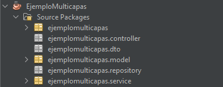
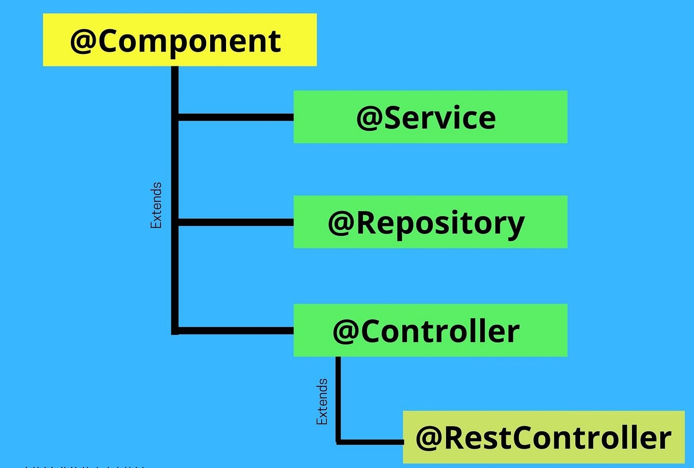
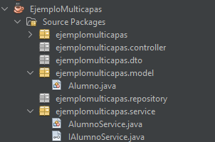

## Temas a tratar

En esta clase se abordarán las siguientes temáticas:

**Lombok**
- @Getter y @Setter
- @NoArgsConstructor y @AllArgsConstructor

**Arquitectura Multicapas:**
- @RestController
- @Repository
- @Service

---

## Lombok

**Lombok** es una biblioteca/librería Java que elimina gran parte del código boilerplate, es decir, código repetitivo y básico que suele ser necesario escribir en clases Java, como getters, setters, constructores, métodos `equals()`, `hashCode()` y otros métodos comunes.

Esta biblioteca opera a través de anotaciones que se aplican a las clases, permitiendo generar automáticamente el código que normalmente escribirías manualmente. Algunas de las anotaciones más comunes de Lombok son `@Getter`, `@Setter`, `@NoArgsConstructor`, `@AllArgsConstructor`, `@ToString`, `@EqualsAndHashCode`, entre otras.

**Por ejemplo**, al utilizar `@Getter` y `@Setter` en una clase, Lombok generará automáticamente los métodos getter y setter para todos los campos de esa clase. De esta manera, reduces la cantidad de código que debes escribir, mejorando la legibilidad y el mantenimiento de tus clases.

De igual manera, `@NoArgsConstructor` y `@AllArgsConstructor` nos generan los constructores vacíos y con parámetros de forma automática:

```java
@Getter @Setter
@NoArgsConstructor
@AllArgsConstructor
public class Alumno {

	private int id;
	private String nombre;
	private String apellido;

}
```

>💡Nota: Lombok no es una característica estándar de Java; es una herramienta externa que se integra con tu flujo de desarrollo.
>
>Para usar Lombok correctamente, debes agregar su dependencia a tu proyecto (generalmente en el archivo pom.xml) y configurar tu entorno de desarrollo para que reconozca y utilice estas anotaciones durante la compilación y el desarrollo.

---

## Arquitectura Multicapa

La arquitectura multicapa en proyectos de Java Spring Boot se organiza en distintas capas que tienen responsabilidades específicas. Cada capa cumple un propósito definido y permite una separación clara de preocupaciones, lo que mejora la modularidad, el mantenimiento y la escalabilidad del sistema.

Veamos cómo se estructuran las cinco capas mencionadas:

1. **Repository (también conocida como DAO - Data Access Object):**
    
    - **Responsabilidad:** Esta capa se encarga de interactuar directamente con la base de datos o el almacenamiento de datos. Aquí se definen las operaciones de acceso a la base de datos, como consultas, inserciones, actualizaciones y eliminaciones (CRUD).
        
    - Generalmente se representa cada clase mediante la annotation**`@Repository`
        
2. **Entity (también conocida como Model):**
    
    - **Responsabilidad:** Representa las entidades/clases de dominio de la aplicación. Estas clases/modelos mapean generalmente de forma directa con las tablas de la base de datos y contienen los atributos y relaciones entre entidades.
        
3. **DTO (Patrón de Diseño Data Transfer Object):**
    
    - **Responsabilidad:** Los DTO son objetos que se utilizan para transferir datos entre diferentes capas de la aplicación. Los DTOs permiten controlar qué datos se exponen a través de la API y cómo se presentan a los clientes. Esto lo veremos en mayor profundidad en clases siguientes 😉.
        
4. **Service:**
    
    - **Responsabilidad:** Contiene la lógica de negocio de la aplicación. Aquí se implementan operaciones más complejas que involucran lógica de aplicación, validaciones, procesamiento de datos y coordinación entre diferentes repositorios.
        
    - Las clases de servicio se anotan típicamente con `@Service` y se utilizan para implementar la lógica de negocio de manera independiente de la capa de controlador.
        
5. **Controller:**
    
    - **Responsabilidad:** Se encarga de recibir las peticiones HTTP, interactuar con los servicios correspondientes y devolver las respuestas adecuadas al cliente. Convierte las peticiones HTTP en llamadas a métodos de servicio y maneja la respuesta al cliente.
        
    - Los controladores se definen con anotaciones como `@RestController` y `@RequestMapping` para mapear las peticiones HTTP a métodos específicos.


### Estructura de un proyecto MULTICAPA

Un proyecto multicapa bien implementado deberá de tener la siguiente estructura:



En particular, cada capa debe incluirse dentro de un paquete específico y cada uno de ellos, debe tener el mismo nombre que la propia capa.


### Anotaciones para capas

En el mundo de Spring Framework, las anotaciones juegan un papel crucial al definir y organizar diferentes componentes de una aplicación. Casi todas las capas que vimos anteriormente se pueden representar, generalmente, mediante annotations.

Estas annotations especiales proporcionan información adicional al contenedor de Spring sobre cómo debe gestionar y tratar ciertas clases en el contexto de la aplicación.

Basándonos en la arquitectura multicapas, vamos a explorar las anotaciones clave: `@Component`, `@Service`, `@Repository`, `@Controller` y `@RestController`.




### Component

Es la anotación base para los componentes administrados por Spring. No especifica ninguna funcionalidad en particular; sin embargo indica que una clase es un componente genérico de Spring como tal.

Las anotaciones `@Service`, `@Repository` y `@Controller` son especializaciones de `@Component`, lo que significa que también se pueden utilizar para identificar componentes de la aplicación.


### @Controller y @RestController

`@Controller` es una anotación especializada que marca clases como controladores en una arquitectura MVC. Los controladores manejan las solicitudes HTTP, invocan la lógica de negocio y preparan los datos para ser devueltos al cliente.

Por su parte, `@RestController` es una extensión de funcionalidad de `@Controller`, combinando `@Controller` y `@ResponseBody`. Este tipo de controlador se utiliza para crear endpoints RESTful que devuelven datos en formato JSON (los que utilizamos actualmente).


### @Repository

Es otra especialización de `@Component`. Se utiliza para marcar las clases responsables de interactuar con la capa de persistencia o acceso a datos (capa repository o DAO propiamente dicha).

> 💡**Nota:** Veremos su implementación en mayor detalle cuando interactuemos directamente con bases de datos mediante JPA + Hibernate y consultas SQL.


### @Service

Es una especialización de `@Component` y se utiliza para identificar clases que contienen lógica de negocio o servicios de la aplicación. Se implementa únicamente en cada una de las clases que pertenecen a la capa de servicio.

Para implementar correctamente la capa de servicio, además de mapear cada una de las clases correspondientes con este annotation, también se deben especificar diferentes interfaces que tendrán los métodos abstractos (sin implementar) de cada una de las clases finales. Es decir, por cada clase service, habrá una interfaz de la cual este implemente.


#### Ejemplo de implementación de Service

Supongamos una clase AlumnoService que implementará las diferentes acciones que puede realizar un alumno dentro de un sistema. Esta clase deberá implementar una interfaz que se deberá llamar de igual manera pero con la letra “I” delante (de interfaz). En este caso, sería “IAlumnoService”.

Todo implementado correctamente debería verse de la siguiente manera:

**Interface IAlumnoService**

```java
public interface IAlumnoService {

	public void crearAlumno (Alumno alu);
	public List<Alumno> obtenerAlumnos();
}
```

**Implementación AlumnoService**

```java
@Service
public class AlumnoService implements IAlumnoService {

@Override
public void crearAlumno (Alumno alu) {
	//lógica para crear el alumno
}

@Override
public List<Alumno> obtenerAlumnos() {
	//lógica para buscar alumnos y devolver la lista
}

}
```

A nivel paquetes debería verse similar a esto:



---

## Ejercicios Prácticos

### Ejercicio Nº 1

Supongamos que tenemos un sistema de alumnos como los ejemplos anteriores que estuvimos viendo y que queremos implementar la arquitectura multicapas con la correspondiente estructura de paquetes… ¿Cómo lo harías?

En caso de que quieras validar una forma de hacerlo, te dejamos a continuación una posible resolución de ejemplo:

[Descargar Resolución](./resources/4-ejemplomulticapa.zip)


### **Ejercicio Nº 2: Practicando Arquitectura multicapas**

Realizar una API que, a partir de brindarle una lista de nombres esta los ordene de forma alfabética y devuelva la lista ordenada en una response.

Para la correcta resolución del ejercicio implementar la arquitectura multicapas en su totalidad, haciendo principal hincapié en la capa **service** (por el momento omitir model, DTO y Repository).

¿De qué manera desarrollarías la lógica de negocio? ¿Cómo harías que service implemente sus métodos? ¿Cómo el Controller podrá hacer acceso a éstos?

>💡**Tener en cuenta:** En caso de que conozcas la annotation `@Autowired` no puedes utilizarla en esta ocasión. La veremos en detalle más adelante 😉

[Descargar resolución](./resources/5_1-resolucionApiOrdenamieto.zip)

[Descargar colección de prueba Postman](./resources/5_2-EjercicioOrdenamientoNombres.postman_collection.json) (deben importar en Postman, no copiar el contenido del json)

**Json de Ejemplo para pruebas con Postman**

```json
[
    "Carlos",
    "Ana",
    "Pedro",
    "Luis",
    "María"
]
```

