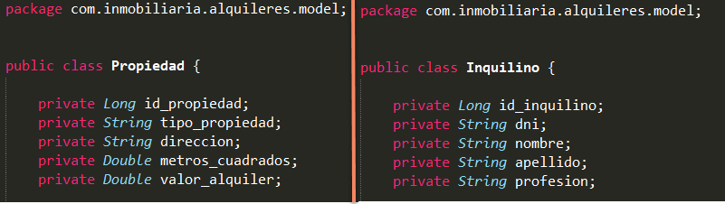
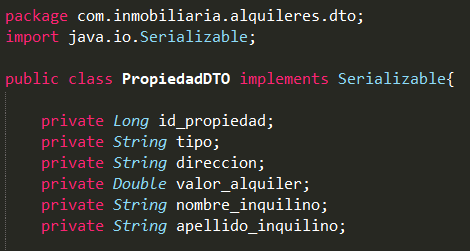
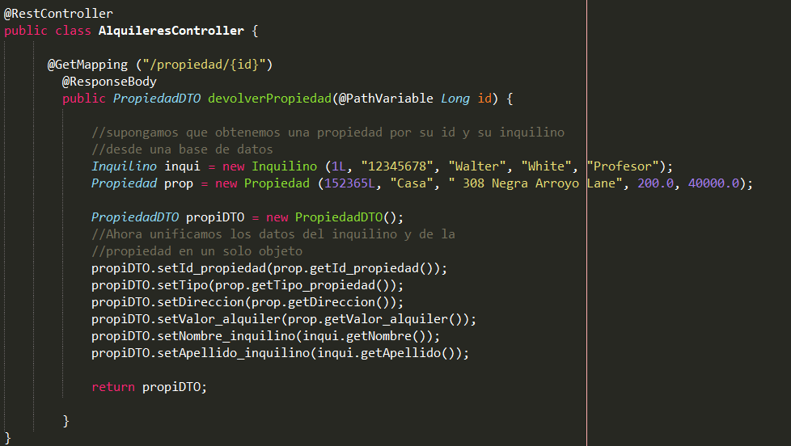
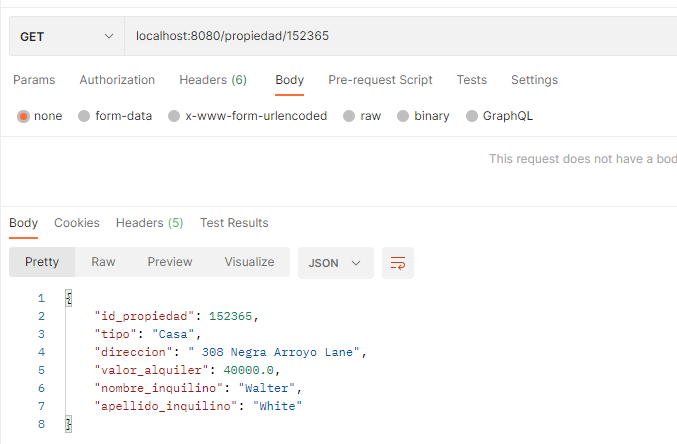

## Temas a tratar

En esta clase se abordarán las siguientes temáticas:

**Arquitectura Multicapas:**
- @RestController
- @Repository
- @Service

**Patrón de Diseño DTO (Data Transfer Object)**
- ¿Qué es? ¿En qué consiste?
- Principales Usos

---

## **Patrón de Diseño DTO (Data Transfer Object)**

Una de las problemáticas más comunes a la hora de desarrollar aplicaciones (sobre todo web) es la existencia en las mismas de la necesidad de interconexión e intercambio de mensajes entre capas u otras aplicaciones.

La necesidad de comunicación hace que sea realmente importante el hecho de encontrar una forma de diseñar cómo o mediante qué formato debe transmitirse la información. Es común que para esto se utilicen las mismas clases entidades que tenemos creadas en el modelo de nuestra aplicación; sin embargo, existe una forma más óptima para llevar a cabo esta tarea: **implementando el patrón DTO.**

**DTO** es un **patrón de diseño** que tiene como finalidad crear un objeto plano (POJO) con una serie de atributos que puedan ser enviados o recuperados del servidor en una sola invocación.

Un **DTO** puede contener datos de múltiples clases, fuentes o tablas de una base de datos y agruparlos en una única clase simple.

En base a esto podemos decir que **DTO** nos permite:

- Crear estructuras de datos **totalmente independientes** al **modelo de datos** (o clases entidades).
    
- Incorporar **en una misma clase** **elementos o datos de clases distintas** según la necesidad que tengamos.
    

Como ventaja principal de implementar DTO, podemos mencionar un caso común que suele darse día a día en un ambiente de desarrollo, como lo es que el modelo de datos deba cambiar por algún motivo en particular. Si esto sucede, no afectará a la forma en la que DTO devuelve los datos, ya que su estructura seguiría siendo la misma.

**Spring** permite manejar **objetos DTO** dentro del controller para luego transformarlos en formato **JSON** y retornarlos al cliente que haya realizado una determinada solicitud.

### **Implementación del patrón DTO**

Supongamos un caso de una inmobiliaria que contiene una clase Propiedad (que muestra los datos de una determinada propiedad en alquiler) y una clase Inquilino (que muestra los datos de un potencial inquilino).

En el modelo de datos, ambas clases estarán por separado, pero si aplicamos el patrón DTO, podemos crear una clase que incorpore los datos que necesitamos de cada una de ellas para devolverlo en una response.

**¡Veamos un ejemplo paso a paso!**

#### Paso 1

Creamos un proyecto SpringBoot con initializr. Luego dentro de él, creamos las clases Propiedad e Inquilino en un paquete llamado model que representará nuestra capa model.

#### **Paso 2**

Creamos un nuevo paquete llamado DTO y dentro crearemos una clase llamada PropiedadDTO, donde incorporaremos datos de las propiedades y de los inquilinos.

#### **Paso 3**

Creamos nuestro paquete controller y dentro armamos nuestra clase controladora. Luego creamos un nuevo endpoint, en donde tendremos un objeto propiedad y otro inquilino que unificaremos en un objeto porpiedaddto para devolverlo mediante `@ResponseBody`.

#### **Paso 4**

Probamos con Postman realizar una solicitud y ver si obtenemos como respuesta el objeto DTO que acabamos de crear

¡Listo! Si todo sale bien y obtenemos la respuesta, ya hicimos nuestra primera implementación del patrón de diseño DTO.

---

## Ejercicios Prácticos

### Ejercicio Nº 1

Una repostera posee una gran cantidad de clientes que son celíacos, para quienes realiza diferentes viandas semanales.

Para poder mejorar su trabajo, necesita del desarrollo de una API que le permita cargar los diferentes platos que hace por semana (7 en total) y asociar a cada plato sus ingredientes.

- De los **platos** se guardan los siguientes datos: id, nombre plato, precio, lista ingredientes
    
- De los **ingredientes** se guarda: id, nombre ingrediente, apto celiaco
    

A partir de eso, la repostera necesita poder consultar a la API por un plato mediante su id y recibir como respuesta el nombre del mismo y si es apto o no para celíacos (la aptitud se determina analizando sus ingredientes, si al menos uno no es apto para celíacos, el platillo ya no es apto).

Para llevar a cabo esto, implementar el patrón de diseño DTO para permitir como respuesta (response) obtener únicamente como dato el nombre del plato consultado y si es apto o no.

### Ejercicio Nº 2

En una competencia de carreras de autos, se tiene una lista de equipos participantes en donde cada equipo cuenta con uno o varios pilotos. Como dato extra, un mismo piloto puede pertenecer a diferentes equipos siempre y cuando sean del mismo país.

Para administrar esta información, se requiere una aplicación que conste de dos clases principales:

- **Equipo**, con los atributos:
    - ID
    - Nombre
    - País

- **Piloto**, con los atributos:    
    - ID
    - Nombre
    - Apellido
    - Edad
    - Nacionalidad

La organización de las carreras necesita una API que permita realizar las siguientes consultas:

i. Ver todos los equipos inscritos en la competencia
- `localhost:8080/equipos/traer`

ii. Ver todos los pilotos registrados en la competencia
- `localhost:8080/pilotos/traer`

iii. Obtener un equipo en particular
- `localhost:8080/equipos/traer/{nombre_equipo}`

iv. Obtener todos los pilotos que formen parte de un equipo en específico
- `localhost:8080/pilotos/traer/{nombre_equipo}`

- Para esta respuesta se debe utilizar el patrón DTO, incluyendo únicamente como dato nombre y apellido del piloto y el nombre del equipo al que pertenece (que debe coincidir con el equipo consultado).    

Además, para cargar nuevos equipos y pilotos, se solicita la creación de un endpoint que permita, mediante el método POST, recibir objetos de equipos y pilotos para almacenarlos en una lista.

Esta lista es la que se utilizará como “base de datos lógica” y se consultará para devolver los datos solicitados en los puntos anteriores.

