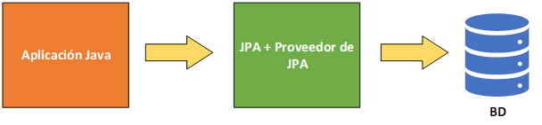
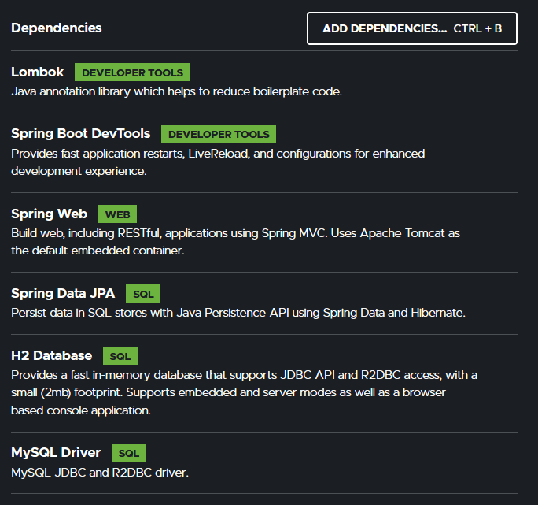
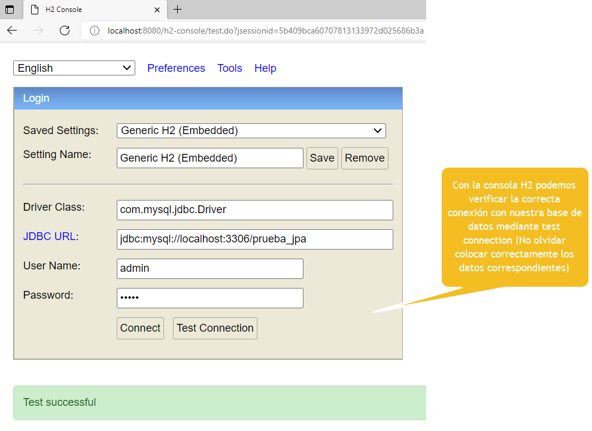

## Temas a tratar

En esta clase se abordarán las siguientes temáticas:

**JPA + Hibernate**
- Repaso concepto de CRUD (Create Read Update Delete)
- Repaso conceptos de ORM y JPA
- ¿Qué es Hibernate?
    - CRUD Completo en base de datos mediante JPA + Hibernate

---

## Implementación de Bases de Datos con SpringBoot, JPA e Hibernate

Uno de los aspectos más importantes a la hora de desarrollar aplicaciones web es sin dudas encontrar la forma de almacenar y manejar los datos que se manejen en ellas. Para ello, existen diferentes tecnologías desde las más simples como JDBC, hasta el uso de herramientas ORM (Object Relational Mapping – Mapeo Objeto Relacional) que nos facilitan la tarea de relacionar nuestras clases con las tablas de nuestras bases de datos.

Anteriormente analizamos JPA como ORM principal a utilizar, el cual nos servía de intermediario entre nuestra aplicación Java y nuestra base de datos.


Cuando analizamos a fondo JPA aprendimos que posee distintos proveedores, donde entre los más conocidos se encuentran Eclipselink (que ya analizamos) y Hibernate. En éste último ahondaremos a continuación en mayor detalle.


## Hibernate

Hibernate es un servicio ORM de persistencia y consultas a bases de datos implementado para Java. No se trata de una herramienta o servicio aparte sino de una implementación o proveedor de JPA (no son conceptos separados, sino que trabajan a la par).

El principal objetivo de Hibernate es el de mapear las clases del modelo de datos de una aplicación y así convertirlos o asociarlos a bases de datos, para ello, como se mencionó anteriormente, se utilizan annotations, las cuales son muy similares a las utilizadas con Eclipselink.

Hagamos un repaso breve de cada una de ellas:

- **@Entity:** Se utiliza para mapear todas las clases que se convertirán en entidades (tablas) en la futura base de datos.
    
- **@Table:** Se utiliza en conjunto con la annotation @Entity. Su principal función es la de mapear con una tabla de una base de datos en particular (en caso de que ya existiese) o establecer el nombre que queremos que la entidad tome como tabla en la base de datos. Su uso es opcional, en caso de que no la utilicemos, JPA tomará automáticamente como nombre de la tabla al nombre de la clase.
    
- **@Id:** Se utiliza para matear las id de cada clase, las cuales se reflejarán en las bases de datos como primary keys (claves primarias).
    
- **@GeneratedValue:** Se utiliza en conjunto con @Id y permite establecer el tipo de secuencia o generación que va a tener una determinada id. Entre las principales estrategias de generación automática de secuencias que posee GeneratedValue se encuentran:
    
    - **Auto:** Es la opción por defecto. Pensada principalmente para ids numéricas. Esta estrategia deja a criterio de Hibernate la forma de generación que considere mejor para la id con la que se esté trabajando.
        
    - **Identity:** Generalmente son autoincrementales (aumentan su valor de forma automática según un incremento que se establezca). Se utilizan principalmente para asignar a claves primarias ya existentes en una base de datos por las cuales Hibernate debe guiarse para continuar la secuencia.
        
    - **Sequence:** Es uno de los tipos de generación de valor más utilizados. Permite generar secuencias numéricas. De forma automática hace el incremento de 1 en 1, pero puede ser personalizada según sea necesario.
        
    - **Table:** Se utiliza para casos donde es necesario asignar claves primarias para las entidades de una base de datos mediante los datos que se encuentren contenidos en una tabla, guardando en ésta el último valor utilizado como referencia.
        
- **@Column:** Se utiliza para mapear cada uno de los atributos de una clase con las columnas de una tabla. No es una annotation obligatoria, en caso de que no se la utilice, JPA toma de forma automática como nombre de columna al nombre del atributo de la clase en cuestión. Es una annotation principalmente pensada para el mapeo de atributos sobre columnas de tablas en bases de datos ya existentes.
    
- **@OneToOne, @OneToMany, @ManyToOne y @ManyToMany:** Son annotations utilizadas principalmente para el mapeo de relaciones entre clases, los cuales se traducirán a nivel de base de datos como relaciones entre tablas (uno a uno, uno a muchos, muchos a uno o muchos a muchos).
    
- **@JoinColumn:** Es utilizada para manifestar los distintos tipos de Join que sean necesarios entre campos de tablas.


---

## ABML (CRUD) con SpringBoot + JPA + Hibernate

Conociendo ya los conceptos de JPA y su principal proveedor Hibernate, es posible implementar ahora una aplicación sencilla con Spring Boot que represente un ABML (alta baja modificación y lectura).

**PASO 1**

Ir a initializr y crear un nuevo proyecto Spring Boot teniendo en cuenta las dependencias especificadas a continuación:




**PASO 2**

Crear una base de datos MySQL llamada prueba_jpa y asignar un usuario y contraseña con todos los privilegios, para ello, utilizar el servidor y gestor de preferencia. Asegurarse que la base de datos se encuentre totalmente vacía (sin ninguna tabla creada).

En este ejemplo se utiliza:

- Xampp Server +PHPMyAdmin
- Nombre base de datos: prueba_jpa
- Usuario: admin
- Contraseña: admin


**PASO 3**

Ir al archivo **application.properties** y configurar los parámetros tal y como se muestran a continuación en la siguiente porción de código. Tener en cuenta de reemplazar los valores según se hayan especificado en la base de datos creada.

```xml
spring.jpa.hibernate.ddl-auto=update
spring.datasource.url=jdbc:mysql://localhost:3306/prueba_jpa?useSSL=false&serverTimezone=UTC
spring.datasource.username=admin
spring.datasource.password=admin
spring.jpa.database-platform=org.hibernate.dialect.MySQL8Dialect
```

El archivo `application.properties` permite establecer diversas configuraciones sobre una aplicación realizada con Spring Boot, en este caso está siendo utilizado para establecer los parámetros de la base de datos.

Los parámetros que se configuran son los siguientes:

- **jpa.hibernate.ddl-auto:** establece la estrategia que utilizarán JPA y Spring para el manejo de tablas. Al colocar el valor en Update se establece que la estrategia será de actualización de tablas.
    
- **datasource.url:** establece la dirección donde se encuentra alojada la base de datos. Es de vital importancia en este apartado colocar correctamente el nombre de la base de datos (en este ejemplo prueba_jpa) y el puerto donde se encuentra levantada la misma (generalmente 3306 en bases de datos mysql). Por otro lado la especificación ?useSSL=false&serverTimezone=UTC establecen que para la conexión no se utilizará SSL y que se tendrá en cuenta una zona horaria estándar para el servidor (esta configuración es de gran importancia para posibles errores en cuanto a diferencias de fecha y hora entre el servidor de base de datos y la aplicación).
    
- **datasource.username:** se utiliza para parametrizar el nombre de usuario de la base de datos (configurado anteriormente en la misma).
    
- **datasource.password:** se utiliza para parametrizar la contraseña asociada al nombre de usuario especificado anteriormente.
    
**spring.jpa.database-platform:** en este apartado se debe especificar el dialecto que se utilizará para comunicar la aplicación con la base de datos MySQL creada. Es importante tener en cuenta la versión del driver de MySQL que se esté utilizando en este momento, para ello, podemos verificar la misma en el archivo **pom.xml**

```xml
<dependency>
	<groupId>mysql</groupId>
	<artifactId>mysql-connector-java</artifactId>
	<scope>runtime</scope>
</dependency>
```

En caso de que en el archivo pom.xml no se especifique ninguna versión en particular, podemos tomar la más reciente. En este ejemplo utilizaremos la versión 8, mediante “**org.hibernate.dialect.MySQL8Dialect**”.


**PASO 4**

- Ejecutar la aplicación. **Nota:** Antes de esto, asegurarse de que el servidor de la base de datos esté activo y ejecutándose.
    
- Una vez ejecutada, intentar acceder a la url: [http://localhost:8080/h2-console/](http://localhost:8080/h2-console/)
    
- Si todo funciona correctamente será posible visualizar una pantalla como la que puede observarse a continuación:



**H2**, es una base de datos “**lógica**” y “**embebida**” (de alguna manera) que ofrece Spring para poder trabajar sobre ella sin la necesidad de tener un servidor de base de datos aparte. No será utilizada en este momento porque ya se cuenta con una base de datos **MySQL** creada, pero se hace referencia por ser una herramienta de gran ayuda.

**PASO 5**

Una vez probada la correcta conexión con la base de datos, procederemos a crear una clase Persona mediante la cual realizaremos un ABML. Para ello crearemos las siguientes clases/interfaces:

- En la capa **model**: clase Persona.
- En la capa **repository**: interface PersonaRepository.
- En la capa **service**: clase PersonaService.

**Capa Model**

```java
@Getter @Setter
@AllArgsConstructor
@NoArgsConstructor
@Entity
public class Persona {
	
@Id
@GeneratedValue(strategy=GenerationType.SEQUENCE)
private Long id;
private String nombre;
private String apellido;
private int edad;

}
```

**Capa Service**

```java
public interface IPersonaService {

	public List<Persona> getPersonas();
	public void savePersona (Persona persona);
	public void deletePersona (Long id);
	public Persona findPersona (Long id);

}
```


```java
@Service
public class PersonaService implements IPersonaService {

@Autowired
private PersonaRepository persoRepo;

@Override
public List<Persona> getPersonas () {

	return persoRepo.findAll();

}

@Override
public void savePersona(Persona perso) {
	persoRepo.save(perso);
}

@Override
public void deletePersona(Long id) {
	persoRepo.deleteById(id);
}

@Override
public Persona findPersona(Long id) {

	//acá si no encuentro a la persona, devuelvo null. Esto lo indica el orElse.
	return persoRepo.findById(id).orElse(null);

}

}
```

**Capa Repository**

```java
// La interface extiende de JpaRepository (ecargada por defecto de manejo de repositorios JPA)
// En los parámetros <> deben ir: <Clase a persistir, tipo de dato de su Id>
@Repository
public interface PersonaRepository extends JpaRepository<Persona,Long> {

}
```

> **⚠️ Importante:** Como resultado de este paso, es posible ejecutar la aplicación y la misma, mediante JPA deberá crear dos tablas:
> 	- La tabla persona
> 	- La tabla hibernate_sequence (para el manejo de secuencias)
    

**PASO 6**

Una vez validado que todo va ok hasta el momento, detenemos la ejecución de nuestra aplicación y continuamos ahora con nuestro Controller:

```java
@RestController
@RequestMapping("/personas")
public class PersonaController {

	@Autowired
	private IPersonaService personaServ;

	@GetMapping ("/traer")
	public List<Persona> getPersonas() {
		return personaServ.getPersonas();
	}

	@PostMapping ("/crear")
	public String savePersona(@RequestBody Persona perso) {
		personaServ.savePersona(perso);
		return "Persona creada correctamente";
	}

	@DeleteMapping ("/borrar/{id}")
	public String deletePersona (@PathVariable Long id) {
		personaServ.deletePersona(id);
		return "Persona eliminadacorrectamente";
	}

	//para hacer un "update" (edición) Hibernate no cuenta con un método específico
	// (como si lo hacía Eclipselink). Por lo que es necesario, buscar la persona
	// a editar, setear sus nuevos valores a nivel lógico y luego enviarlos a la BD
	// mediante el método Save. Recordemos que save es "guardar" por lo que sirve
	// tanto para altas como para modificaciones ya que "guarda" los datos.

	@PutMapping ("/editar/{id}")
	public Persona editPersona (@PathVariable Long id,
															@RequestParam ("nombre") String nombreModif,
															@RequestParam ("apellido") String apellidoModif,																
															@RequestParam ("edad") int edadModif,																
															) {

//buscamos la persona en cuestión
Persona perso = personaServ.findPersona(id);

perso.setNombre(nombreModif);
perso.setApellido(apellidoModif);
perso.setEdad(edadModif);

personaServ.savePersona(perso);

return perso;

}
```


**PASO 7**

Una vez configurado todo, ejecutaremos la aplicación creada y probaremos cada uno de los endpoints mediante Postman.

**Ejemplos para** **POST /personas/crear**

```json
{
"nombre":"Cristiano",
"apellido":"Ronaldo",
"edad":38
}
```

```json
{
"nombre":"Cesc",
"apellido":"Fábregas",
"edad":36
}
```

**Ejemplo GET presonas/traer**

**Ejemplo DELETE personas/borrar/2**

**Ejemplo PUT personas/editar/1?nombre=Lionel&apellido=Messi&edad=36**

💡 Al utilizar Postman, podemos especificar los nuevos parámetros en la pestaña “params”. Esto agregará los mismos de forma automática a la URL sin que tengamos que hacerlo manualmente.

---

## Ejercicio Práctico en clase

Imagina que te encuentras trabajando como desarrollador y te han encargado el diseño de una API para una clínica veterinaria. Esta API servirá como una herramienta fundamental para gestionar la información de los pacientes y los servicios médicos ofrecidos por la clínica.

Tu tarea consiste en diseñar una API que permita realizar operaciones básicas de administración para la clínica veterinaria. Debes crear endpoints que faciliten la gestión de pacientes, servicios médicos y otras funcionalidades esenciales.

Para ello, tener en cuenta la creación de los siguientes end-points:

### **Gestión de Pacientes**

#### Registro de nuevo paciente

- Método: POST
- Endpoint: `localhost:8080/pacientes/registrar`


#### Ver lista de pacientes

- Método: GET
- Endpoint: `localhost:8080/pacientes/lista`

#### Eliminar paciente

- Método: DELETE
- Endpoint: `localhost:8080/pacientes/eliminar/{id}`

#### Actualizar información del paciente

- Método: PUT
- Endpoint: `localhost:8080/pacientes/editar/{id}`

#### Buscar paciente por ID

- Método: GET
- Endpoint: `localhost:8080/pacientes/buscar/{id}`

### **Gestión de Servicios Médicos**

#### Agregar nuevo servicio

- Método: POST
- Endpoint: `localhost:8080/servicios/agregar`

#### Ver lista de servicios ofrecidos

- Método: GET
- Endpoint: `localhost:8080/servicios/lista`

#### Eliminar servicio

- Método: DELETE
- Endpoint: `localhost:8080/servicios/eliminar/{id}`

#### Actualizar información del servicio

- Método: PUT
- Endpoint: `localhost:8080/servicios/editar/{id}`

#### Buscar servicio por ID

- Método: GET
- Endpoint: `localhost:8080/servicios/buscar/{id}`

>💡 Recuerda utilizar patrón DTO, arquitectura multicapas y todos los conceptos que conformen buenas prácticas de desarrollo de APIs.

