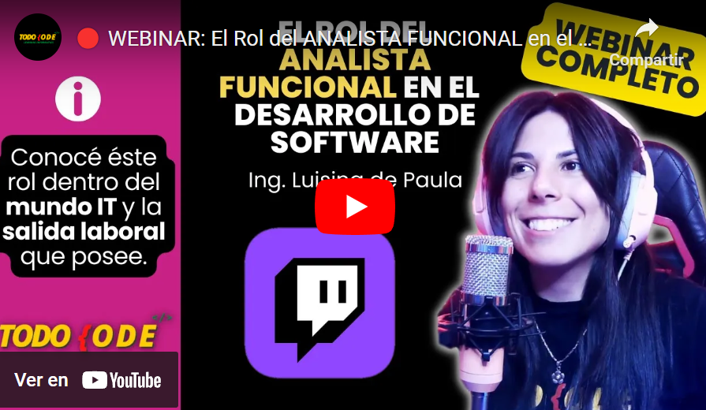
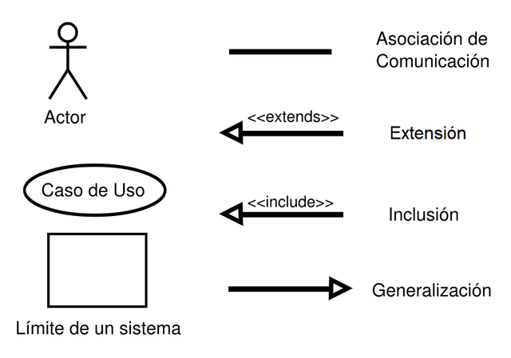
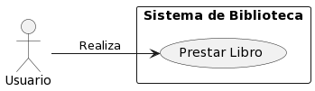
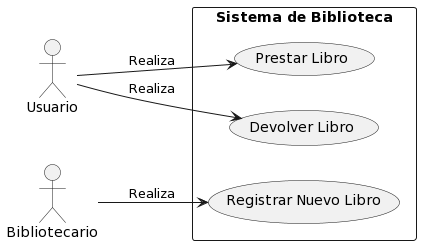
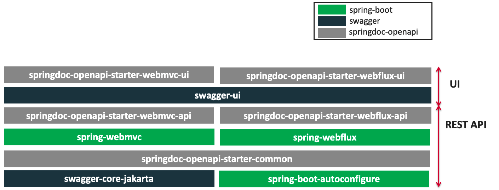
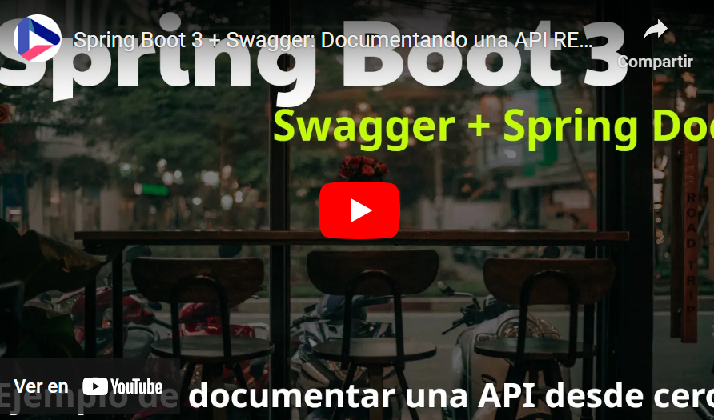
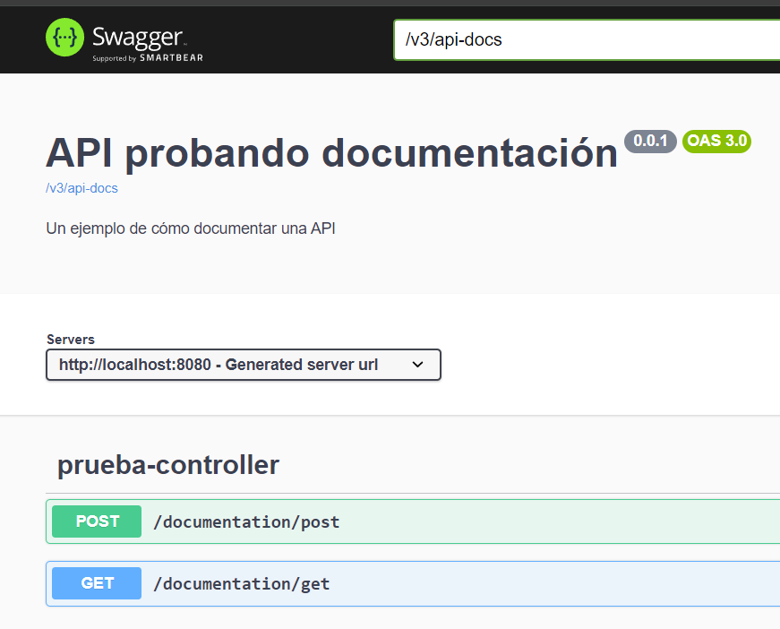

## Temas a tratar

En esta clase se abordarán las siguientes temáticas:

**Swagger y Documentación**
- ¿Qué es documentar? ¿Por qué es importante la documentación?
- Spring Doc ¿Qué es?
- Introducción a Swagger
- Implementación de Swagger + Spring Doc en un proyecto de Spring Boot 3

---

## **¿Qué es Documentar en Desarrollo de Software?**

La documentación en desarrollo de software se refiere al proceso de crear y mantener registros escritos, diagramas, explicaciones y manuales que describen cómo funciona y cómo se utiliza un sistema, programa o aplicación.

Una **documentación** puede incluir:

1. **Comentarios en Código:** Explicaciones dentro del código fuente que hacen más comprensible su funcionamiento y propósito.
    
2. **Manuales de Usuario:** Instrucciones detalladas sobre cómo utilizar el software.
    
3. **Documentación Técnica:** Detalles técnicos sobre la arquitectura, la lógica de negocio, las dependencias y los flujos de datos.
    
4. **Diagramas y Especificaciones:** Representaciones visuales que explican la estructura y el comportamiento del software.


### Documentación de **Requerimientos Funcionales**

Los requerimientos funcionales describen las funciones y capacidades específicas que debe tener un sistema, software o producto para cumplir con las necesidades del usuario y los objetivos del negocio. Estos requisitos definen qué debe hacer el sistema en base a las necesidades (requerimientos) del cliente.

#### **¿Qué Contienen los Requerimientos Funcionales?**

1. **Casos de Uso:** Escenarios que describen cómo interactúan los usuarios con el sistema, detallando sus acciones y respuestas del sistema.
    
2. **Funcionalidades del Sistema:** Descripciones detalladas de lo que el sistema debe realizar en términos de operaciones específicas.
    
3. **Requisitos de Datos:** Especificaciones sobre cómo se manejarán, almacenarán y procesarán los datos en el sistema.
    
4. **Restricciones del Sistema:** Limitaciones y condiciones que afectan la funcionalidad del sistema.
    
5. **Interfaz de Usuario:** Especificaciones sobre la interfaz gráfica y la interacción del usuario con el sistema.


#### **Rol del Analista Funcional**

El analista funcional desempeña un papel clave en la elaboración de estos documentos:

1. **Recolección de Requerimientos:** Colabora con los _stakeholders_ para identificar, documentar y validar los requerimientos funcionales del sistema.
    
2. **Análisis y Priorización:** Analiza y prioriza los requerimientos, identificando los más importantes para el éxito del proyecto.
    
3. **Redacción de Documentos:** Es responsable de documentar los requerimientos funcionales de manera clara, precisa y completa.
    
4. **Validación y Verificación:** Trabaja con el equipo para asegurar que los requerimientos sean coherentes, verificables y comprensibles.
    
5. **Comunicación con el Equipo de Desarrollo:** Actúa como un puente entre los _stakeholders_ y el equipo de desarrollo, asegurando que las necesidades del cliente se comprendan correctamente.
    
6. **Actualización y Mantenimiento:** Durante el ciclo de vida del proyecto, el analista funcional actualiza y mantiene los requerimientos a medida que evolucionan las necesidades del negocio.
    

>💡 **¿Quieres saber más sobre la importancia de los requerimientos funcionales y el rol que cumple un analista funcional en este proceso? Te dejamos a continuación un video al respecto:**

[](https://youtu.be/MRCnLtxwHOc)

### ¿Qué es un caso de uso?

Un caso de uso en desarrollo de software es una técnica para definir las interacciones entre un sistema (software) y sus actores (usuarios u otros sistemas). Proporciona una descripción detallada de cómo un usuario final interactúa con el sistema para lograr un objetivo específico.

Un caso de uso se compone de:

1. **Actor:** Representa a cualquier entidad (usuario, sistema externo, dispositivo, etc.) que interactúa con el sistema.
    
2. **Funcionalidad:** Describe una función o tarea específica que el sistema debe realizar para cumplir con las necesidades de un actor.
    
3. **Descripción:** Detalla la interacción entre el actor y el sistema en un escenario particular.
    
4. **Escenario principal:** Describe la secuencia de pasos que el actor sigue para lograr un objetivo dentro del sistema.
    
5. **Escenarios alternativos o excepcionales:** Incluye casos en los que el flujo principal se desvía debido a condiciones excepcionales o alternativas.


#### **Ejemplo de un caso de uso:**

Imaginemos un sistema de gestión de biblioteca con múltiples actores, como "Usuario" y "Bibliotecario". Un caso de uso podría ser:

**Caso de Uso:** Prestar libro

**Actores:** Usuario, Bibliotecario

**Objetivo:** Permitir que un usuario tome prestado un libro de la biblioteca.

**Descripción:**

1. El usuario inicia sesión en el sistema de gestión de la biblioteca.
    
2. El usuario busca el libro por título o autor.
    
3. El sistema muestra una lista de libros disponibles.
    
4. El usuario selecciona un libro.
    
5. El sistema verifica si el libro está disponible para préstamo.
    
6. Si está disponible, el usuario solicita el préstamo.
    
7. El sistema registra el préstamo y actualiza el estado del libro.
    
8. Se completa la transacción, y el libro se retira del inventario.
    

**Escenario alternativo:**

- Si el libro no está disponible, el sistema muestra un mensaje indicando la no disponibilidad y sugiere libros similares.


#### Representación gráfica de casos de uso

Los casos de usos de representan tanto de forma escrita y detallada como de forma gráfica. En la representación gráfica interfieren exactamente los mismos actores y elementos, solo que varía su forma de “representación” propiamente dicha utilizando una serie de símbolos. Los más conocidos son los siguientes:



Nuestro caso de uso de sistema de bibliotecas podría verse algo similar a esto:



Si agregáramos más funcionalidades, el caso de uso y también incorporáramos al bibliotecario como actor, podría verse como:



> **💡Dato Importante:** Si bien generalmente la documentación funcional en general está de la mano de los Product Owners o Analistas Funcionales, es muy común que si no existen estos roles en las empresas, sean los desarrolladores quienes deban crear esta documentación. En caso de que no deban crearla, de igual manera deben conocer su simbología para poder interpretarla y traducirla luego a código.


### Desarrolladores y documentación

No solo los **analistas funcionales** o de requerimientos o los **líderes de proyectos**, **product owners** o **project managers** son los encargados de **documentar**. También los **desarrolladores** deben brindar su aporte de documentación, sobre todo en lo que respecta a las especificaciones técnicas.

La **documentación técnica** permite transferir conocimientos a otros desarrolladores, futuros integrantes del equipo o a uno mismo en el futuro (claramente al pasar el tiempo es MUY NORMAL que nos olvidemos cómo hicimos o funcionan ciertas cosas).

Tener **documentación técnica**, nos facilita entender el funcionamiento del código, su propósito y su implementación.

Por otro lado, la documentación permite a la vez una comunicación clara y efectiva entre miembros del equipo. **No todos los desarrolladores** tienen el **mismo nivel de comprensión del código**; la documentación actúa como un punto de referencia común para asegurar que todos estén en la misma página.


#### Mantenimiento y escalabilidad

La documentación cumple un papel FUNDAMENTAL cuando tenemos un proyecto de software que tiene mirada a futuro donde implementarán nuevas funcionalidades o recibirá mantenimiento constantemente.

**Un código bien documentado es más fácil de mantener**. Cuando se requieren modificaciones o correcciones, la documentación sirve como guía para entender cómo funciona el código y qué impacto puede tener un cambio.

**La documentación clara reduce la probabilidad de cometer errores**. Si alguien más puede entender el propósito y el funcionamiento del código, es menos probable que se realicen cambios que causen problemas.

**Un código bien documentado tiende a ser más confiable**. La documentación detalla su propósito y cómo se espera que funcione, lo que facilita las pruebas y la detección de errores.

En resumen, la documentación técnica efectiva es crucial para la colaboración en equipo, la fiabilidad del código, la escalabilidad del proyecto y el desarrollo profesional del desarrollador. Es una habilidad valiosa que no solo beneficia al equipo actual, sino también a futuros desarrolladores que trabajen en el proyecto.

---

## Spring Doc

El trabajo diario de los **desarrolladores backend** gira en torno al uso y aprovechamiento de las **APIs**. A medida que nos adentramos en nuevas tecnologías, patrones y estructuras, se vuelve crucial aprender a crear APIs que no solo sean eficientes, sino también comprensibles para otros usuarios.

Este requisito se vuelve aún más evidente en entornos de **arquitectura orientada a microservicios**, donde coexisten numerosas APIs. Estas pueden ser desarrolladas por equipos diferentes, lo que subraya la importancia de contar con **documentación precisa y actualizada**.

La **documentación de las APIs** se puede abordar de diversas maneras: desde el clásico documento Word, que suele quedarse desactualizado, hasta el uso de herramientas basadas en la especificación **OpenAPI**, como **Swagger**. Esta última opción permite generar documentación visual mientras se desarrollan las APIs, utilizando anotaciones, evitando así discrepancias entre la API real y su descripción, aunque puede agregar información no funcional al código.



Para facilitar el proceso de documentación técnica a los desarrolladores existen varias herramientas que simplifican este proceso, una de ellas es Spring Doc, la cual se implementa con mayor fuerza a partir del lanzamiento de Spring Boot 3.

**Spring Doc** es un conjunto de herramientas dentro del ecosistema de Spring Framework diseñado específicamente para facilitar la generación de documentación para APIs RESTful. Esta suite se centra en la generación automática de documentación a partir del código fuente y los comentarios asociados en el código, lo que simplifica en gran medida el proceso de documentación de las APIs creadas con Spring.

Puedes leer más información detallada sobre Spring Doc Open Api en este [enlace](https://springdoc.org/).

[](https://springdoc.org)

---

## Swagger

Cuando hablamos de **Swagger** nos referimos a una serie de reglas, especificaciones y herramientas que nos ayudan a **documentar nuestras APIs**. De esta manera, podemos realizar documentación que sea realmente útil para las personas que la necesitan. **Swagger** nos ayuda a crear documentación que todo el mundo entienda.

**Swagger** es una herramienta que permite diseñar, construir, documentar y consumir servicios web **RESTful**. Proporciona un marco de trabajo para describir la estructura de APIs de una manera estándar y legible tanto para humanos como para máquinas.

Swagger utiliza un formato conocido como OpenAPI Specification (anteriormente conocido como Swagger Specification), que define los endpoints, parámetros, respuestas, métodos permitidos y otros detalles de una API.


### Swagger UI

**Swagger UI** es una interfaz de usuario que interpreta y visualiza la documentación generada por Swagger. Ofrece una representación interactiva de la API basada en la especificación OpenAPI, lo que permite a los desarrolladores probar y comprender rápidamente cómo interactuar con la API.

Las diferencias principales entre Swagger y Swagger UI radican en su función y uso:

- **Swagger**: Es una suite completa que incluye el conjunto de herramientas para diseñar, construir, documentar y consumir APIs. Incluye el editor Swagger para diseñar la especificación OpenAPI, generadores de código, validadores y más.
    
- **Swagger UI**: Es específicamente una interfaz de usuario que interpreta y muestra visualmente la documentación generada por la especificación OpenAPI. No crea ni define la especificación en sí misma; se utiliza para visualizar la documentación que ya ha sido escrita utilizando Swagger u otra herramienta compatible con OpenAPI.


## Implementación de Swagger + Spring Doc en un proyecto de Spring Boot 3

A continuación veremos el paso a paso de cómo implementar Spring Doc + Swagger para lograr una documentación técnica interactiva en nuestras APIs desarrolladas con Spring Boot 3.

#### Paso 1

Agregamos al proyecto que queramos documentar la dependencia necesaria en nuestro archivo pom.xml.

```xml
<dependency>
      <groupId>org.springdoc</groupId>
      <artifactId>springdoc-openapi-starter-webmvc-ui</artifactId>
      <version>2.3.0</version>
</dependency>
```

#### Paso 2

En este caso vamos a realizar una serie de configuraciones en nuestro archivo **application.propperties**

```java
# habilitar o no api-docs y swagger-ui
springdoc.api-docs.enabled = true
springdoc.swagger-ui.enabled = true

# url o ruta de swagger-ui
springdoc.swagger-ui.path=/doc/swagger-ui.html
```

#### Paso 3

Para este ejemplo crearemos un paquete controller y una clase controller de ejemplo con un método Get y otro Post:

```java
package com.pruebaspringdoc.ejemploDoc.controller;

import org.springframework.web.bind.annotation.GetMapping;
import org.springframework.web.bind.annotation.PostMapping;
import org.springframework.web.bind.annotation.RequestMapping;
import org.springframework.web.bind.annotation.RestController;

@RestController
@RequestMapping("/documentation")
public class PruebaController {

    @GetMapping("/get")
    public String ejemploGet() {

        return "Prueba get";
    }

    @PostMapping("/post")
    public String ejemploPost() {

        return "Prueba post";
    }

}
```


#### Paso 4

Procedemos a ejecutar nuestra aplicación de Spring Boot y nos dirigimos a la url que hayamos configurado en nuestro archivo **application.propperties**.

En este caso sería: **[localhost:8080/doc/swagger-ui.html](http://localhost:8080/doc/swagger-ui.html)** y obtendríamos lo siguiente como resultado


¡Ya está! Así de sencillo tenemos documentada nuestra API y hasta podemos hacer pruebas sobre ellas con las funciones interactivas que nos da Swagger UI.

>💡¿Quieres ver algunas opciones más o el paso a paso explicado en video? Te dejamos a continuación una explicación muy detallada al respecto:

[](https://youtu.be/-SzKqwgPTyk)

### Personalización de documentación

La página generada por Swagger UI no es estática, sino que podemos personalizarla un poco según nuestros gustos. Para ello, podemos generar un bean en nuestra clase donde se encuentra el método main para que lleve a cabo estas personalizaciones de la siguiente manera:

```java
package com.pruebaspringdoc.ejemploDoc;

import io.swagger.v3.oas.models.OpenAPI;
import io.swagger.v3.oas.models.info.Info;
import org.springframework.boot.SpringApplication;
import org.springframework.boot.autoconfigure.SpringBootApplication;
import org.springframework.context.annotation.Bean;

@SpringBootApplication
public class EjemploDocApplication {

	public static void main(String[] args) {

		SpringApplication.run(EjemploDocApplication.class, args);
	}

	@Bean
	public OpenAPI customOpenAPI() {
		return new OpenAPI().info(new Info()
				.title("API probando documentación")
				.version("0.0.1")
				.description("Un ejemplo de cómo documentar una API"));
	}

}
```

Si todo sale bien, veríamos algo así como resultado:



¡Listo! Encabezado de nuestra documentación totalmente PERSONALIZADO.

¿Quieres descargar el proyecto completo para tenerlo de referencia? Haz click para ello en el siguiente [enlace](./resources/6-ejemploDocSwagger.zip)


## 📝 Ejercicio Práctico

Elegir una API desarrollada anteriormente en otra oportunidad e incorporar en su proyecto las dependencias y configuraciones necesarias para poder documentar mediante Swagger y Spring Doc.

**¿Has podido documentar correctamente? ¿Lograste desplegar la la Swagger UI?¿Personalizaste campos?**

Te sugerimos compartir pantalla o capturas de tu documentación con otros compañeros para ver si los mismos interpretan lo que la misma quiere decir o a qué hace referencia cada una de sus partes.

