## Temas a tratar

En esta clase se abordarán las siguientes temáticas:

- Introducción a la calidad de software
- Herramientas para evaluar código: SonarQube
- Testing de Software
    - El Rol del Analista QA y el desarrollador
    - Testing Manual
    - Testing Automatizado

- Pruebas Unitarias    
    - Introducción a JUnit
    - @Test y aserciones de JUnit

---

## ¿Qué es la calidad de software?

El glosario de la IEEE (Institute of Electrical and Electronics Engineers) para la ingeniería de software define la calidad del software como: _“El grado con el cual un sistema, componente o proceso cumple con los requerimientos y las necesidades o expectativas del cliente o usuario”_

La calidad del software es un concepto integral que abarca la excelencia en todas las etapas del ciclo de vida del desarrollo de software. Implica no solo la ausencia de defectos, sino también la satisfacción de los requisitos del cliente y la conformidad con estándares y expectativas.


### Importancia de la calidad de software

Es importante asegurar la calidad de software por diferentes motivos. Veamos algunos de ellos:

1. **Satisfacción del cliente:** Un software de calidad cumple con las expectativas del cliente y ofrece una experiencia positiva, lo que genera confianza y fidelidad.
    
2. **Reducción de costos a largo plazo:** La detección temprana de errores y su corrección durante las fases iniciales del desarrollo minimizan los costos asociados con reparaciones en etapas avanzadas del proyecto.
    
3. **Reputación y competitividad:** El software de calidad mejora la reputación de la empresa, su imagen de marca y su competitividad en el mercado.
    
4. **Productividad y eficiencia:** Un software de calidad permite a los usuarios trabajar de manera eficiente, sin interrupciones ni errores frecuentes, lo que aumenta la productividad.
    
5. **Mantenibilidad y escalabilidad:** Un código bien estructurado y un diseño sólido facilitan la incorporación de nuevas funciones y la adaptación a cambios futuros, lo que aumenta la vida útil del software.


### ¿Cómo se mide la calidad de software?

La calidad del software es medible y varía de un sistema a otro, o de un programa a otro. Puede medirse después de elaborado el producto, pero esto puede resultar muy costoso si se detectan problemas derivados de imperfecciones en el diseño, por lo que es imprescindible tener en cuenta tanto la obtención de la calidad como su control durante todas las etapas del ciclo de vida del software.

Los requisitos de un sistema pueden ser _funcionales_ **(QUÉ)** o _no funcionales_ **(CÓMO)**, **el cumplimiento de estos requisitos nos permitirá entender la calidad esperada por los usuarios desde enfoques diferentes**.

Para **evaluar la calidad del software**, se utilizan diferentes enfoques y métricas que abarcan aspectos clave del producto.

1. **Métricas de Fiabilidad:**
    - **Tasa de fallos:** Número de veces que el software falla durante un período específico.
    - **Tiempo medio entre fallos (MTBF):** Promedio de tiempo que transcurre entre fallos.
    - **Tiempo de recuperación:** El tiempo que se necesita para restaurar el software después de un fallo.
        
2. **Métricas de Mantenibilidad:**
    - **Complejidad del código:** Medida de la complejidad del código fuente.
    - **Índice de cohesión:** Grado en que los componentes de un módulo están relacionados entre sí.
    - **Índice de acoplamiento:** Grado de interdependencia entre módulos.
        
3. **Métricas de Eficiencia:**
    - **Tiempo de respuesta:** Tiempo que tarda el software en responder a una solicitud.
    - **Consumo de recursos:** Uso de recursos como CPU, memoria y ancho de banda.
        
4. **Métricas de Usabilidad:**
    - **Tiempo de aprendizaje:** Tiempo que requiere un usuario para aprender a utilizar el software.
    - **Satisfacción del usuario:** Opiniones y valoraciones de los usuarios sobre la experiencia de uso.
        
5. **Métricas de Seguridad:**
    - **Número de vulnerabilidades:** Cantidad de brechas de seguridad identificadas.
    - **Tiempo medio para resolver una vulnerabilidad:** Tiempo necesario para corregir una vulnerabilidad una vez identificada.


### ¿Qué métodos de evaluación existen para los equipos de desarrollo de software?

1. **Pruebas de Software:**
    - **Pruebas unitarias:** Verifican que cada unidad de código funcione correctamente.
    - **Pruebas de integración:** Evalúan la interacción entre diferentes componentes.
    - **Pruebas de rendimiento:** Verifican el comportamiento del software bajo cargas específicas.
        
2. **Inspecciones y Revisiones:**
    - **Revisión de código:** Análisis del código por parte de otros desarrolladores para identificar errores y mejoras.
    - **Inspecciones de diseño:** Evaluación de la arquitectura y diseño del software para encontrar posibles problemas.
        
3. **Análisis estático y dinámico:**
    - **Análisis estático:** Revisión del código sin ejecutarlo, busca posibles errores y problemas de estilo.
    - **Análisis dinámico:** Evaluación del software en ejecución para identificar fallos y comportamientos inesperados.


### ¿Qué modelos de calidad existen?

Si bien existen varios modelos que aseguran la calidad de softwarem podemos destacar entre los principales a los siguientes:

1. **Modelo ISO/IEC 25010:**
    - Define un conjunto de características y subcaracterísticas de calidad del software, incluyendo funcionalidad, fiabilidad, usabilidad, eficiencia, mantenibilidad, portabilidad, seguridad y compatibilidad.
        
2. **Modelo CMMI (Capability Maturity Model Integration):**
    - Proporciona un marco para mejorar la capacidad de una organización para desarrollar software de alta calidad mediante la mejora continua de los procesos.    


### **¿Quiénes son responsables de la calidad del software?**

La calidad del producto es responsabilidad de todos los miembros del equipo y debe procurarse en cada etapa del desarrollo, desde la definición de los requerimientos y estrategias de implementación y control, hasta su aplicación más directa en el código.

Para asegurar la misma, debemos **hacernos preguntas** como por ejemplo:
- ¿Están los requisitos plasmados de una manera adecuada y sin ambigüedades?
- ¿Existen criterios de aceptación establecidos? ¿Están escritos de forma precisa y medible?
- ¿Están definidos los parámetros de calidad que debe satisfacer el sistema?
- Para los bugs detectados, ¿se han informado al equipo de desarrollo? ¿Se ha abordado su corrección?
- ¿Se han realizado pruebas de robustez del sistema?
- ¿Se han realizado pruebas de estrés?
- ¿Se tienen claros los requerimientos no funcionales, y cómo se determinarán sus cumplimientos?


### Glosario de la Calidad de Código

- **Código duplicado** → Este término se utiliza cuando hablamos de un código fuente que aparece más de una vez, un buen desarrollo está asociado a la reutilización del mismo.
    
- **Código muerto** → Es el código que se encuentra en nuestra aplicación, pero nunca es utilizado. Normalmente aparece después de hacer una refactorización del código.
    
- **Estándares de codificación** → Se refiere a convenciones para escribir código fuente, las cuales frecuentemente son dependientes del lenguaje de programación. Las convenciones más comunes hacen referencia a: nombres de variables, indentaciones, espaciado, entre otros.
    
- **Bugs** → Un bug es un error o un defecto en el software que hace que un programa funcione de forma incorrecta.
    
- **Complejidad ciclomática** → Es una métrica de calidad de software basada en el cálculo del número de caminos independientes que tiene nuestro código. Cuanto más compleja sea la lógica de un código, más difícil será de entender, mantener y probar.
    
- **Cobertura de código** → La cobertura de código (o code coverage) es una medida que nos indica el porcentaje de código validado por los tests. Generalmente con una mayor cobertura aseguramos que no se introducen errores en una mayor parte del código, pero esto dependerá de la funcionalidad real que cubran los tests.
    
- **Código Spaghetti** → Se refiere a un tipo de código fuente desorganizado y difícil de entender, similar a la apariencia de un plato de espaguetis. Este código tiende a tener una estructura compleja y entrelazada, con una lógica confusa y conexiones caóticas entre diferentes partes del código.


### Herramientas para evaluar la calidad de código

Existen diferentes herramientas que nos permiten evaluar la calidad de nuestro código fuente, una de las más conocidas es **SonarQube**.

Se trata de un software libre (en su versión community) que nos permite evaluar la calidad realizando un análisis estático del código, con el objetivo de advertirnos sobre diferentes puntos a mejorar.

>💡El _análisis estático del código_ al proceso de evaluar el software sin ejecutarlo.


### SonarQube

SonarQube es una herramienta de código abierto diseñada para evaluar y mejorar la calidad del código fuente en proyectos de desarrollo de software.

Es uilizada principalmente en entornos Java, ofrece un análisis estático avanzado que identifica problemas potenciales, vulnerabilidades de seguridad, código duplicado, y proporciona métricas detalladas sobre la calidad del código.

>💡Si bien **SonarQube** es una de las herramientas más utilizadas y conocidas, existe un ecosistema Sonar con otras herramientas complementarias. Puedes investigar sobre ellas o ver documentación oficial en su web oficial [https://www.sonarsource.com](https://www.sonarsource.com/)


#### Principales Funcionalidades

1. **Análisis Estático:**
    - Realiza un análisis exhaustivo del código Java sin ejecutarlo, identificando posibles errores, vulnerabilidades y malas prácticas de codificación.
        
2. **Métricas de Calidad:**
    - Proporciona una amplia gama de métricas que evalúan la complejidad, la duplicación, las normas de codificación y la cobertura de pruebas, entre otros aspectos.
        
3. **Detección de Código Duplicado:**
    - Identifica segmentos de código repetitivos y sugiere refactorizaciones para mejorar la calidad y la mantenibilidad del código.
        
4. **Seguimiento de Problemas:**
    - Permite el seguimiento de problemas y su evolución a lo largo del tiempo, facilitando la identificación y resolución de problemas en el código.
        
5. **Integración con el Ciclo de Desarrollo:**
    - Se puede integrar en procesos de desarrollo continuo (CI/CD) para automatizar análisis y garantizar una mejora continua de la calidad del código.


#### Descarga e Instalación

Para descargar **SonarQube** vamos a hacerlo desde la web oficial: [https://www.sonarsource.com/products/sonarqube/downloads/](https://www.sonarsource.com/products/sonarqube/downloads/) y elegiremos por supuesto la versión Community:

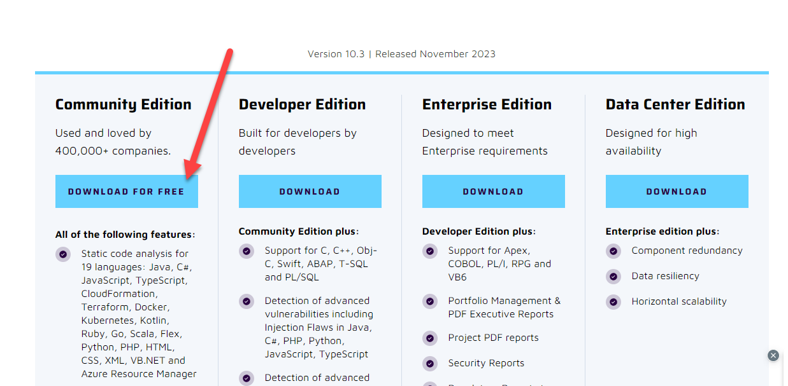

Una vez descargado vamos a ejecutarlo mediante consola y el archivo StartSonar.bat (dependiendo de tu sistema operativo, deberás posicionarte de forma distinta en la carpeta correspondiente a sonar)

En el caso de Windows, abrimos una nueva terminal/consola y nos posicionamos en la carpeta /bin/windows-x86-64 para luego ejecutar el archivo correspondiente:

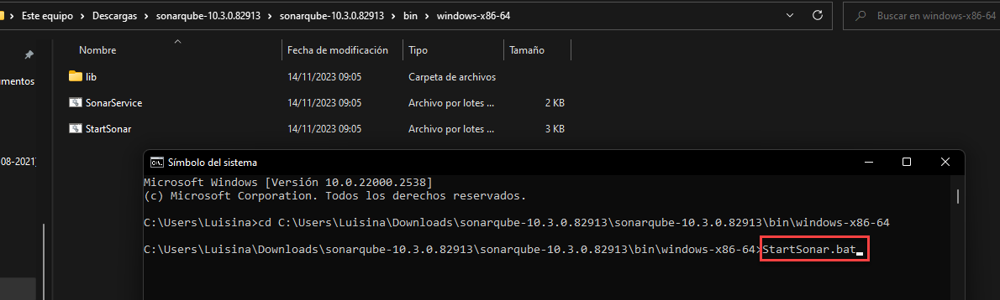

Una vez ejecutado el comando, deberemos esperar unos segundos y podremos acceder a SonnarQube mediante [http://localhost:9000/](http://localhost:9000/) obteniendo una pantalla similar a esta:

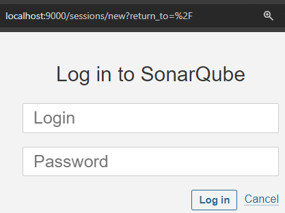

Por defecto, sus credenciales son **admin** y **admin**. Si es la primera vez que ingresamos, nos obligará a cambiar la contraseña por defecto mediante la siguiente pantalla:

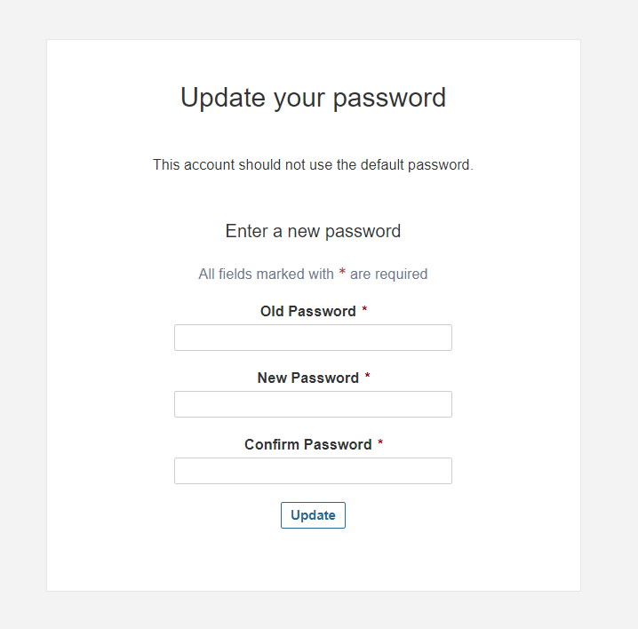

La cambiamos, y si todo sale bien, obtendremos la siguiente pantalla:

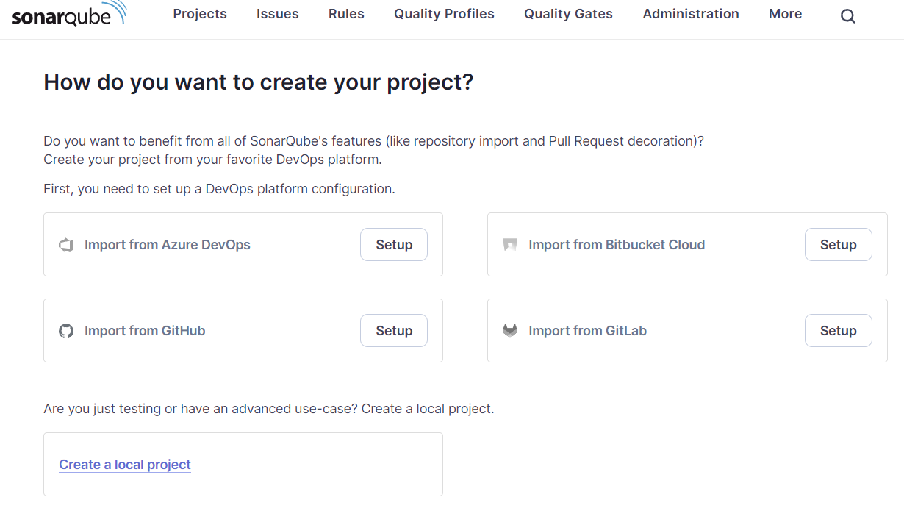

Como se puede observar, nos da diferentes formas con las que podemos “importar” nuestros proyectos para poder analizarlos con **SonarQube**.

Vamos a incorporar alguno de los proyectos que tengamos creados de forma local y los introduciremos manualmente. Para ello iremos a la opción “**Create a local project**”

Vamos a poner un nombre. En este caso vamos a utilizar al proyecto de la Api de Ordenamiento. Si no la tienes a mano, te dejamos el [link de descarga](./resources/5_1-resolucionApiOrdenamieto.zip)

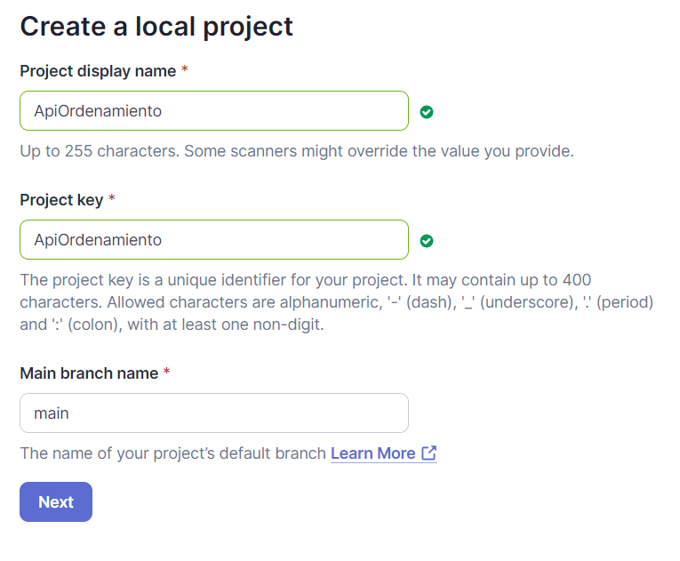

Luego elegiremos para usar los Settings Globales

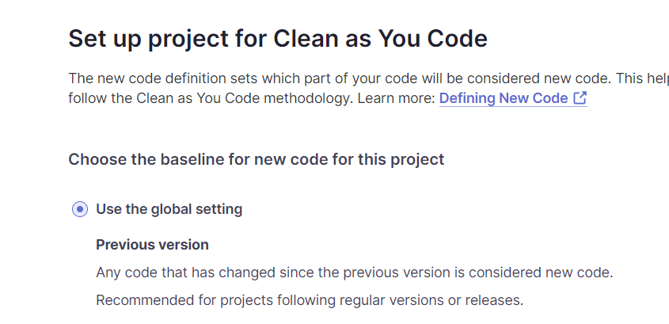

Y ya tendremos creado nuestro proyecto en SonarQube, ahora solo resta integrarlo con nuestro proyecto local mediante la opción **“Locally”**

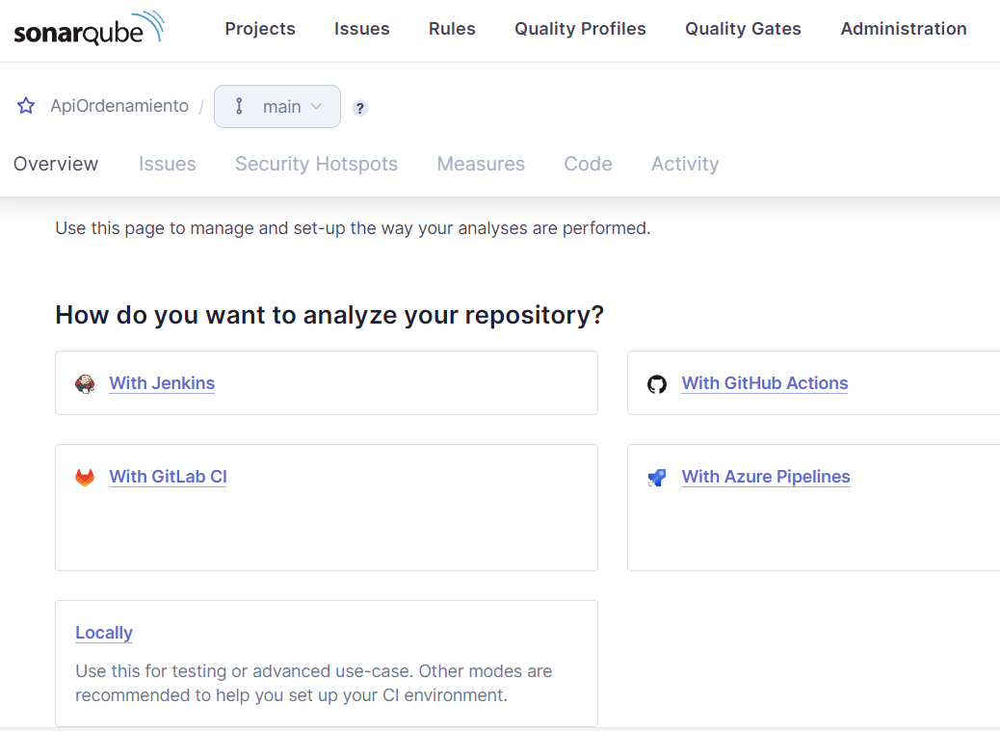

Una vez en este menú, SonarQube nos solicita crear un Token. Vamos a dejar el nombre por defecto que nos da y daremos click a Generate.

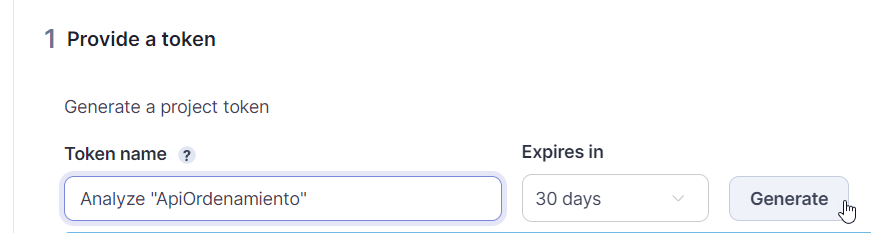

A partir de esto nos generará un Token, este es MUY IMPORTANTE que lo copiemos en un archivo de texto extra para usarlo más tarde antes de hacer click en Continue. Una vez copiado si continuamos con la siguiente pantalla.

En el nuevo apartado nos solicita seleccionar con qué gestor de dependencias creamos nuestro proyecto. En este caso vamos a seleccionar Maven:

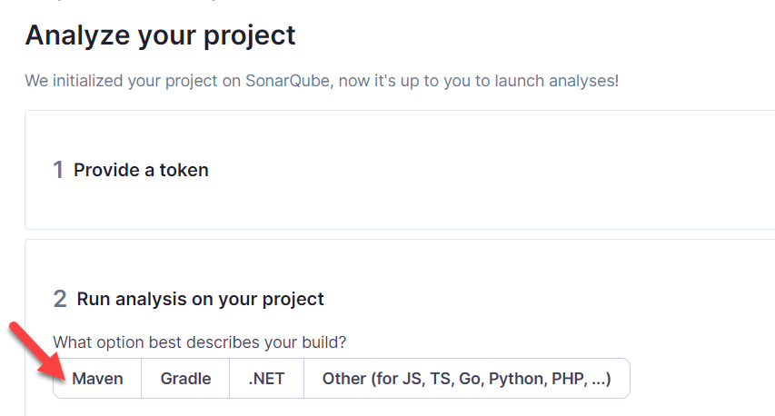

Esto nos va a generar un código que es el que necesitamos para ejecutar SonarQube en nuestro proyecto de manera local:

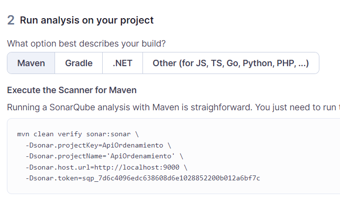

Vamos a copiar el código y luego abrir nuestro proyecto “ApiOrdenamiento” de forma local utilizando Intellij IDEA como IDE

Una vez abierto, vamos al apartado Maven (arriba a la derecha de nuestro proyecto)

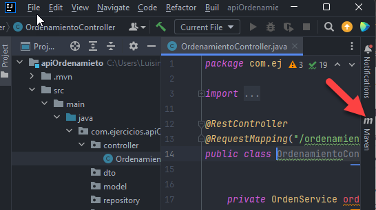

Y vamos a seleccionar la opción “Execute Maven Goal”

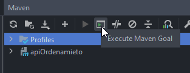

y a pegar en la nueva ventana que nos abre, el comando que acaba de generarnos SonarQube

 ⚠️ Como detalle IMPORTANTE no te olvides de borrar las “barras invertidas” que te crea el código automático de Sonar Qube, deberías convertir por ejemplo este código:

```java
mvn clean verify sonar:sonar \
  -Dsonar.projectKey=ApiOrdenamiento \
  -Dsonar.projectName='ApiOrdenamiento' \
  -Dsonar.host.url=http://localhost:9000 \
  -Dsonar.token=sqp_7d6c4096edc638608d6e1028852200b012a6bf7c
```

A este (sin las barras)

```java
mvn clean verify sonar:sonar 
  -Dsonar.projectKey=ApiOrdenamiento 
  -Dsonar.projectName='ApiOrdenamiento' 
  -Dsonar.host.url=http://localhost:9000 
  -Dsonar.token=sqp_7d6c4096edc638608d6e1028852200b012a6bf7c
```

Una vez ingresado el código, apretamos enter (para ejecutar el mismo) y **SonarQube** empezará a descargar todas las dependencias que necesite (esto puede demorar un rato dependiendo de tu conexión a internet y de la cantidad de dependencias que necesite)

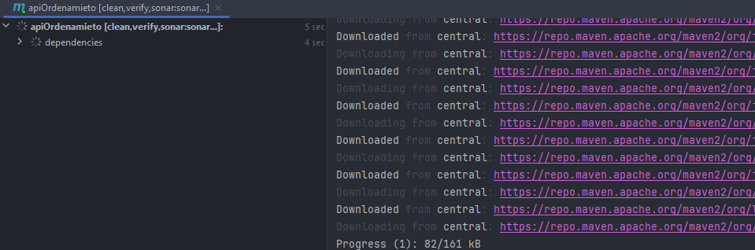

Si todo sale bien, en nuestra consola encontraremos un mensaje similar a este:

```
[INFO] ANALYSIS SUCCESSFUL, you can find the results at: http://localhost:9000/dashboard?id=ApiOrdenamiento
```

La URL que allí se especifica nos dará los detalles y “mejoras” que SonarQube cree que podemos implementar. En este caso, veremos una pantalla similar a esta:

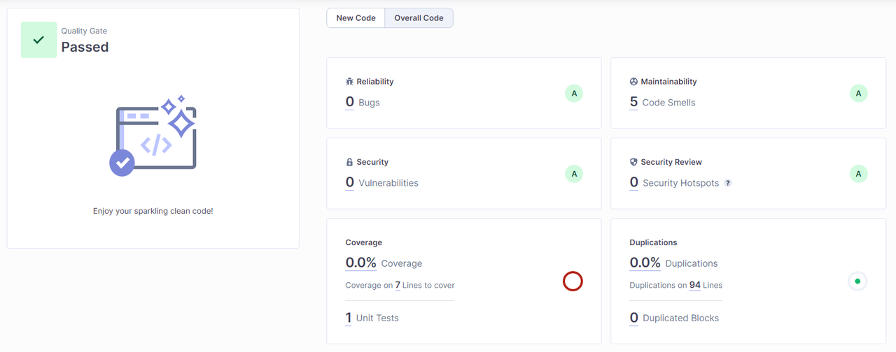

Como podemos ver en este caso pasamos la prueba sin problema alguno. Nos especifica que tenemos 0 bugs, 5 Code Smells (que son patrones o indicios que podrían indicar posibles problemas en el código fuente a futuro) en este caso es un número muy bajo, no tenemos incidencias de seguridad, no tenemos código duplicado pero tenemos un 0% de cobertura de código, lo cual es un MUY MAL VALOR.

>**💡¿Por qué tenemos 0% de cobertura de código?** Básicamente porque NO IMPLEMENTAMOS (aún) ningún tipo de **test unitario,** pero MUY PRONTO lo haremos 😉

---

## ¿Qué es el Testing de Software?

El **testing de software** es un proceso crucial en el desarrollo de programas para asegurar su calidad, identificar posibles errores y garantizar que cumplan con los requisitos establecidos. Consiste en evaluar el software en diferentes etapas de su desarrollo para detectar fallos y verificar que funcione según lo esperado.

En general existen dos principales tipos de testing: el manual (o también conocido como funcional) y el automatizado.


### ¿Por qué es importante testear?

Ya sabemos la importancia de tener un software y un código de calidad. Para esto, existen diferentes roles que tratan de asegurar la mayor calidad posible de nuestras aplicaciones mediante la implementación de diferentes tipos de testeo. Estos profesionales son llamados **Testers** o **Analistas QA.**

En un ambiente donde no esté delimitado el rol de un **Analista QA**, puede suceder que el mismo desarrollador sea el encargado de realizar las correspondientes pruebas tanto manuales como automatizadas.

Para entender un poco más sobre estos roles y la importancia de los mismos o como tu puedes llevar a cabo uno de ellos en caso de que te toque en tu ambiente laboral, te recomendamos el siguiente webinar en video:

[](https://youtu.be/c0Hk1thK5Wk)

### Testing Manual

Es el proceso de testeo o de ejecución de pruebas por parte de un ser humano, donde un tester sigue procedimientos predefinidos para evaluar el software simulando como sería la interacción de un usuario real sobre el sistema.


#### Características del testing manual

- Requiere la intervención humana para ejecutar pruebas, observar resultados y registrar hallazgos.
- Se centra en la evaluación de la experiencia del usuario, la usabilidad y el comportamiento funcional del software.
- Tiene flexibilidad para identificar problemas que podrían pasar desapercibidos en pruebas automatizadas.
    

#### Ventanas y desventajas del testing manual

**Ventajas**

- Útil para pruebas exploratorias, donde se buscan errores no contemplados en casos de prueba predefinidos.
- Ideal para pruebas de usabilidad, interfaces de usuario y situaciones complejas difíciles de automatizar.
    

**Desventajas**

- Es más lento y propenso a errores humanos.
- No es escalable ni repetible en comparación con pruebas automatizadas.
    

### Testing Automatizado

Es el proceso de testeo o de ejecución de pruebas que implica el uso de herramientas y scripts para llevar a cabo las mismas de forma automatizada, sin intervención humana directa.

#### Características del testing automatizado

- Utiliza scripts y herramientas específicas para ejecutar pruebas de manera eficiente y repetible.
- Ideal para pruebas de regresión, rendimiento, carga y repetición de escenarios complejos.
    

#### Ventajas y desventajas del testing automatizado

**Ventajas:**

- Mayor velocidad y eficiencia en la ejecución de pruebas.
- Repetibilidad y escalabilidad para manejar pruebas en un gran número de casos.
    

**Desventajas:**

- Difícil de aplicar en pruebas que requieren interpretación humana o análisis subjetivos.
- Requiere inversión inicial en la creación y mantenimiento de scripts de prueba.
    

### Tipos de tests automatizados

Dentro del testing automatizado, existen varios tipos de pruebas que se utilizan para evaluar diferentes aspectos del software. Algunos de los tipos más comunes de pruebas automatizadas incluyen:

#### **Pruebas Unitarias:**

- Evalúan componentes individuales o unidades de código, como funciones o métodos, para verificar su funcionamiento aislado.
    

#### **Pruebas de Integración:**

- Verifican la interacción entre diferentes componentes o módulos del software para asegurar que funcionen correctamente en conjunto.
    

#### **Pruebas Funcionales:**

- Comprueban que el software cumpla con los requisitos funcionales esperados por el usuario.
    

#### **Pruebas de Regresión:**

- Aseguran que las nuevas actualizaciones o cambios en el código no introduzcan errores en áreas previamente funcionales.
    

#### **Pruebas de Aceptación:**

- Validan si el software cumple con los criterios de aceptación establecidos por el cliente o usuario final.
    

#### **Pruebas de Carga:**

- Evalúan el rendimiento del software bajo diferentes niveles de carga para verificar su estabilidad y capacidad de manejar picos de uso.
    

#### **Pruebas de Estrés:**

- Someten al software a condiciones extremas para evaluar su comportamiento y capacidad de recuperación en situaciones límite.
    

#### **Pruebas de Seguridad:**

- Evalúan la resistencia del software ante posibles amenazas y vulnerabilidades de seguridad.
    

Si bien existen gran cantidad de formas de testear una aplicación, en esta ocasión vamos a centrarnos en las **PRUEBAS UNITARIAS**.

---

## Pruebas Unitarias

Las pruebas unitarias son un tipo de prueba en el desarrollo de software que evalúa unidades individuales de código, como funciones, métodos o clases, de manera aislada. Se centran en validar el comportamiento esperado de cada unidad de manera independiente y exhaustiva.


### **Proceso de Creación de Pruebas Unitarias**

Para poder llevar a cabo la planificación y correcta ejecución de nuestras pruebas unitarias debemos llevar a cabo los siguientes pasos:

1. **Definición de Casos de Prueba:**
    - Se crean casos de prueba para cada función o método, cubriendo diferentes escenarios posibles.
        
2. **Desarrollo de las Pruebas:**
    - Se escriben scripts o código para ejecutar los casos de prueba, verificando que el comportamiento sea el esperado.
        
3. **Ejecución y Análisis de Resultados:**
    - Se ejecutan las pruebas y se analizan los resultados para identificar fallos o comportamientos inesperados.
        

---

### 📝Actividad Práctica

A partir del siguiente código:

```java
public class Calculadora {

	public Double calcularSuma (int num1, int num2) {
		return (double) num1+num2;
	}

		public Double calcularMenor (int num1, int num2) {
			if (num1<=num2) {
				return (double) num1;
			}
			else {
				return (double) num2;
			}
	}

}
```

💡 Realiza el análisis correspondiente y determina:
- ¿Cuántos tests unitarios crees que podrían haber?
- ¿Cuáles serían estos tests unitarios?
    

#### Resolución

- El método calcularSuma sin dudas puede ser testeado unitariamente, ya que cumple una sola funcionalidad, que es sumar dos números y otorga un solo resultado.
    
- El método CalcularMenor puede tener dos tests unitarios diferentes:
    - Uno que valide el caso en que num1 sea mayor a num2
    - Otro que valide el caso en que num2 sea mayor a num1
        
- Incluso podríamos agregar un tercer test unitario si quisiéramos para analizar el caso de que sean iguales.
   

### ¿Qué herramientas podemos utilizar para llevar a cabo pruebas unitarias?

Si bien podemos realizar los tests de forma manual, existen diferentes herramientas que nos facilitan la creación de tests unitarios. Algunas de las más conocidas para Java son:

- JUnit
- TestNG
- Mockito
    

### Implementando JUnit

JUnit es un marco de pruebas unitarias para Java que permite la creación, ejecución y verificación de pruebas de manera automatizada. Es una herramienta ampliamente utilizada en el desarrollo de software Java para asegurar la calidad del código.

¡Veamos cómo implementaríamos JUnit en un proyecto con Spring Boot!

#### Paso 1: Dependencias

Por defecto si creamos un proyecto con Spring Boot mediante initializr veremos que se nos incluye de forma automática la siguiente dependencia en nuestro pom.xml

```xml
<dependency>
			<groupId>org.springframework.boot</groupId>
			<artifactId>spring-boot-starter-test</artifactId>
			<scope>test</scope>
</dependency>
```

`spring-boot-starter-test` incluye automáticamente **JUnit 5 (JUnit Jupiter)** y otras bibliotecas/librerías útiles para pruebas en proyectos de Spring Boot.


#### Paso 2: Utilización de paquetes

Los tests en Java suelen ubicarse en un paquete separado del código fuente principal para mantener una estructura organizada y distinguir claramente las pruebas del código de producción. Una convención común es tener un directorio o paquete paralelo al código fuente principal, con una estructura similar.

Por defecto, cualquier proyecto que creemos con Spring Boot mediante Initializr ya incluirá ésta estructura:

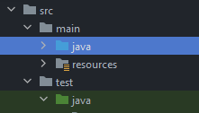


#### Paso 3: Creación de Tests + annotation @Test

Creamos una clase llamada **CalculadoraTest** (haciendo referencia a que son los tests de nuestra clase **Calculadora**) dentro del paquete principal de tests que tenemos generado.

Crearemos nuestro primer TestUnitario y lo marcaremos mediante la annotation `@Test`

```java
package com.JUnit.testeandoClaculadora;
import com.JUnit.testeandoClaculadora.model.Calculadora;
import org.junit.jupiter.api.Test;
import static org.junit.jupiter.api.Assertions.assertEquals;

public class CalculadoraTest {

    @Test
    public void testCalcularSuma() {
        Calculadora calculadora = new Calculadora();
        Double resultado = calculadora.calcularSuma(3, 5);
        assertEquals(8.0, resultado); // Verifica que la suma sea correcta (3 + 5 = 8)
    }
}
```

>💡`@Test` es una anotación fundamental en JUnit. Se utiliza para marcar un método como un caso de prueba. Al aplicar `@Test` sobre un método en una clase de prueba, se indica a JUnit que este método debe ejecutarse como una prueba unitaria cuando se realice la suite de pruebas.

>💡La anotación `@Test` pertenece al paquete `org.junit.jupiter.api`, que es parte de JUnit 5. En versiones anteriores de JUnit, como JUnit 4, la anotación `@Test` estaba en un paquete diferente (`org.junit.Test`).

Como podemos ver, en este primer test se utiliza uno de los métodos de `Assertions` de JUnit: `assertEquals`, para verificar si el resultado devuelto por el método calcularSuma es correcto (más adelante especificamos los más utilizados de ellos).

Es importante notar que se instancia la clase `Calculadora` y se llama a cada método con diferentes valores de entrada para validar su funcionamiento.

Una vez programado nuestro test, hacemos click derecho sobre el y luego “**Run CalculadoraTest**” para ver si pasa la prueba solicitada:

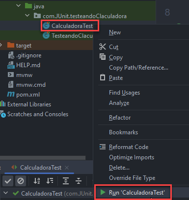

Si todo sale bien y nuestra prueba es correcta, obtendremos el siguiente mensaje en consola:

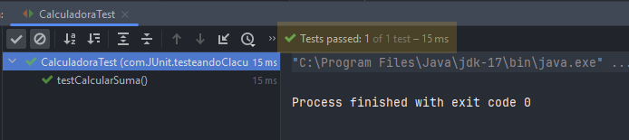

Y ¡Listo! Con esto aprendimos a crear nuestra primera prueba unitaria.

Te dejamos el código para que puedas descargar este ejemplo de referencia en el siguiente [link de descarga](./resources/9_testeandoCalculadora.zip)


### Aserciones de JUnit

En JUnit, las aserciones son métodos que se utilizan para verificar el comportamiento esperado de los resultados de las pruebas unitarias. Aquí tienes algunas de las aserciones más comunes en JUnit y sus principales usos:

`assertEquals`:

- Compara si dos valores son iguales.
- Uso común para verificar resultados numéricos, cadenas de texto, objetos, etc.

```java
assertEquals(5, myNumber); // Verifica si myNumber es igual a 5
assertEquals("Hola", myString); // Verifica si myString es igual a "Hola"
```


`assertTrue` / `assertFalse`:

- Verifica si una condición es verdadera o falsa, respectivamente.
- Útil para validar condiciones booleanas.

```java
assertTrue(result > 0); // Verifica si result es mayor que 0
assertFalse(isEmpty); // Verifica si isEmpty es falso
```


`assertNull` / `assertNotNull`:

- Verifica si un valor es nulo o no nulo, respectivamente.
- Se emplean para validar si un objeto o referencia es null o no.

```java
assertNull(myObject); // Verifica si myObject es null
assertNotNull(myObject); // Verifica si myObject no es null
```


`assertSame` / `assertNotSame`:

- Comprueba si dos referencias apuntan al mismo objeto o no, respectivamente.
- Utilizado para verificar la igualdad de referencias de objetos.

```java
assertSame(expected, actual); // Verifica si expected y actual son la misma referencia
assertNotSame(expected, actual); // Verifica si expected y actual son referencias diferentes
```


`assertThrows`:

- Verifica si un método lanza una excepción específica.
- Útil para probar métodos que deben lanzar excepciones en ciertos casos.

```java
assertThrows(NullPointerException.class, () -> { myObject.method(null); }); // Verifica si se lanza una NullPointerException
```

Estas aserciones son fundamentales para definir las expectativas y validar los resultados esperados en las pruebas unitarias. Ayudan a asegurar que el comportamiento del código bajo prueba sea el correcto y se ajuste a lo esperado.

---

## 📝 Ejercicios Prácticos

💡Recuerda que los siguientes ejercicios prácticos los llevarás a cabo en clase, por lo que contarás con la ayuda del profesor/a y tus compañeros para validar las resoluciones haciendo _live coding_ y puestas en común de resultados 😉


### Ejercicio Nº 1: Pruebas Unitarias

Complementar al proyecto Calculadora con las pruebas unitarias faltantes. Agregar una para el caso de que num1 sea mayor a num2 y otra para el caso contrario.

¿Qué resultados se obtienen al ejecutar los 3 tests? ¿Pasan todos correctamente?


### Ejercicio Nº 2: SonarQube

A partir de la aplicación de calculadora que acabamos de desarrollar con sus correspondientes test unitarios:

- Ejecutar SonarQube y crear un nuevo proyecto local llamado Calculadora
- Realizar las configuraciones necesarias y ejecutar SonarQube en el proyecto calculadora finalizado.
- Analizar los resultados obtenidos en SonarQube… ¿Qué porcentaje de cobertura se obtiene? ¿Es necesario algún test Unitario adicional?

