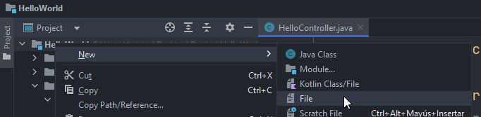
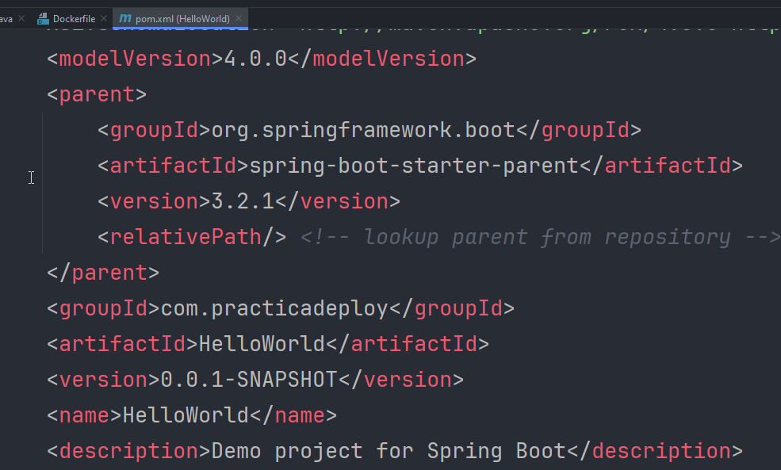
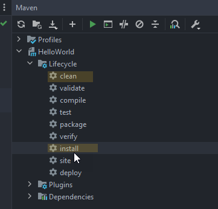
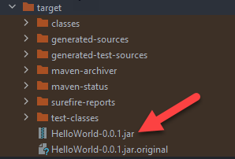
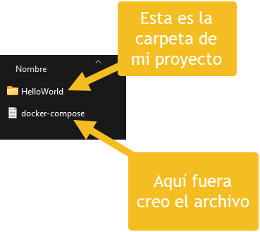
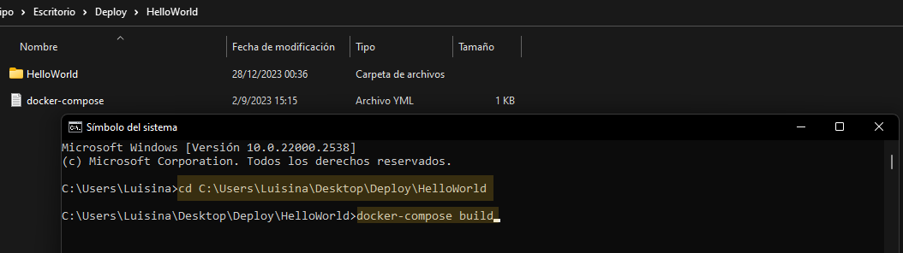
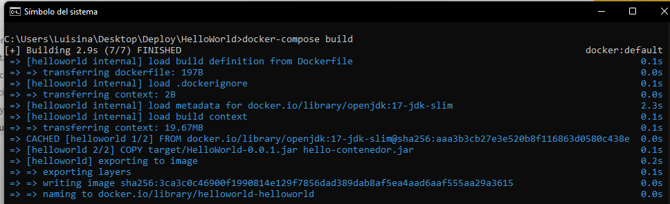
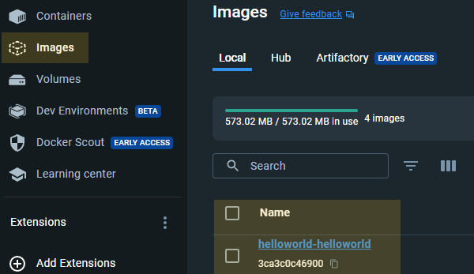
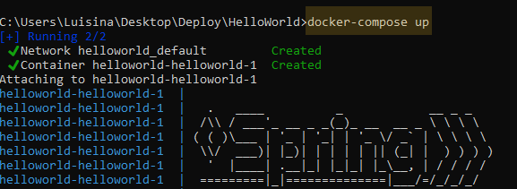
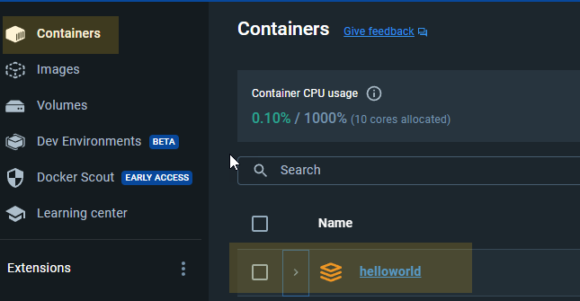

## Temas a tratar

En esta clase se abordarán las siguientes temáticas:

- ¿Qué es un despliegue/deploy?
- ¿Qué es Docker? ¿Para qué sirve?
- Instalación de Docker
- Deploy de una app de Spring Boot mediante Docker.

---

## ¿Qué es un proceso de Despliegue/Deploy?

El término "deploy" se refiere al proceso de implementar o lanzar una aplicación en un entorno operativo donde estará disponible para su uso. En el contexto de Java/Spring Boot, el despliegue involucra tomar el código fuente de una aplicación, compilarlo (si es necesario), y luego ejecutarlo en un entorno donde los usuarios puedan interactuar con ella, generalmente, un servidor web o cloud.


### **¿Qué implica el proceso de deploy en Java/Spring Boot?**

El proceso de Deploy en Java con Spring Boot conlleva una serie de pasos y etapas. Algunas de ellas pueden ser las siguientes (obviamente sujetas a modificación en base a cada proyecto y entorno en particular)

1. **Preparación del código**: Antes del despliegue, es crucial asegurarse de que el código esté listo para su implementación. Esto incluye la compilación del código fuente si se trata de un proyecto Java, asegurando que todas las dependencias estén actualizadas y gestionadas mediante herramientas como Maven o Gradle en el caso de proyectos Spring Boot.
    
2. **Configuración del entorno**: Se prepara el entorno donde se ejecutará la aplicación. Esto puede ser un servidor físico, una máquina virtual, un contenedor (como Docker) o un servicio en la nube (como AWS, Azure, Google Cloud, etc.). Se configuran las variables de entorno, bases de datos, servidores de aplicaciones y otros recursos necesarios para que la aplicación se ejecute correctamente.
    
3. **Empaquetado de la aplicación**: En el caso de Spring Boot, la aplicación se empaqueta típicamente como un archivo JAR (Java Archive) que contiene todas las dependencias necesarias para su ejecución. Este JAR es autosuficiente y puede ejecutarse en cualquier entorno compatible con Java.
    
4. **Despliegue**: El archivo JAR se coloca en el entorno configurado y se ejecuta utilizando comandos específicos de Spring Boot o mediante la configuración de un servidor de aplicaciones como Tomcat o Jetty. La aplicación estará lista para recibir peticiones y proporcionar los servicios que ha sido diseñada para ofrecer.
    
5. **Monitorización y mantenimiento**: Una vez que la aplicación está en funcionamiento, es esencial monitorear su rendimiento, manejar posibles errores, realizar actualizaciones o parches si es necesario y asegurarse de que la aplicación esté disponible y funcione correctamente para los usuarios.
    

#### **Herramientas comunes utilizadas en el proceso de deploy con Java/Spring Boot**

- **Maven o Gradle**: Para la gestión de dependencias y la construcción del proyecto.
    
- **Docker**: Para empaquetar la aplicación y sus dependencias en contenedores.
    
- **Jenkins o Travis CI**: Para la automatización de compilación, pruebas y despliegue continuo.
    
- **Servidores de aplicaciones**: Como Apache Tomcat, Jetty, WildFly, etc., para ejecutar la aplicación en un entorno de producción.
    

💡El proceso de **deploy** puede variar en complejidad dependiendo del tamaño y la naturaleza de la aplicación, así como de los requisitos específicos del entorno de implementación. Sin embargo, su objetivo principal es asegurar que la aplicación esté disponible y funcione correctamente para los usuarios finales.

---

## ¿Qué es Docker?

Docker es una plataforma de software que permite a los desarrolladores empacar, distribuir y ejecutar aplicaciones en entornos aislados llamados contenedores.

Estos contenedores contienen todo lo necesario para que una aplicación se ejecute de manera independiente, incluyendo el código, las bibliotecas, las herramientas y las configuraciones.

Veamos una explicación más detallada al respecto en el siguiente video:

[](https://youtu.be/OEvHEeDpg_o)

### Glosario **de Docker**

- **Contenedores**: Son entornos ligeros y portables que contienen todo lo necesario para ejecutar una aplicación, incluyendo el código, las bibliotecas y las dependencias. Los contenedores son aislados unos de otros y comparten los recursos del sistema operativo subyacente.
    
- **Imágenes**: Son plantillas de solo lectura que contienen el sistema operativo, el entorno de ejecución y las dependencias de una aplicación. Los contenedores se crean a partir de estas imágenes.
    

### ¿Cómo instalar Docker?

Para utilizar Docker de manera más sencilla en nuestro ordenador, vamos a proceder a instalar, además de la herramienta en si a la cual accederemos mediante consola, a la aplicación desktop que nos permite visualizar todo el proceso que haremos más adelante para el deploy de forma más gráfica.

Para llevar a cabo la instalación correctamente, les dejamos a continuación el siguiente video explicativo paso a paso:

[](https://youtu.be/cWuirzMOwwg)
---

## Deploy de una aplicación mediante Docker

Antes de entrar en el paso a paso específico para hacer un deploy de una app Java/SpringBoot mediante Docker, veamos algunos de los beneficios de usar ésta herramienta en este proceso.

### **Beneficios de usar Docker en el proceso de deploy**

En el contexto de un **deploy en Java**, Docker desempeña un papel fundamental al facilitar la creación de entornos consistentes y portables para ejecutar aplicaciones Java/Spring Boot.

Entre algunos de los beneficios de utilizar Docker en este proceso encontramos:

- **Portabilidad**: Las imágenes Docker son portables y pueden ejecutarse en cualquier entorno que admita Docker, lo que facilita la consistencia entre entornos de desarrollo, pruebas y producción.
    
- **Aislamiento**: Los contenedores Docker proporcionan un alto nivel de aislamiento, lo que significa que las aplicaciones pueden ejecutarse sin interferir con otras aplicaciones o el sistema operativo subyacente.
    
- **Escalabilidad y eficiencia**: Docker facilita la escalabilidad horizontal, permitiendo ejecutar múltiples instancias de la aplicación en contenedores separados de manera eficiente.
    

### Realizar un Deploy con Docker (Paso a Paso)

#### Paso 1: Elegir un proyecto

Para llevar a cabo el proceso de deploy y hacer pruebas sencillas, vamos a desarrollar un proyecto con Spring Boot, en este caso, haremos un HelloWorld con un controller básico. Puedes descargar el proyecto base en **[este link](https://start.spring.io/#!type=maven-project&language=java&platformVersion=3.2.1&packaging=jar&jvmVersion=17&groupId=com.practicadeploy&artifactId=HelloWorld&name=HelloWorld&description=Demo%20project%20for%20Spring%20Boot&packageName=com.practicadeploy.HelloWorld&dependencies=web)**


#### Paso 2: Crear Dockerfile

En el directorio raíz de nuestro proyecto vamos a crear un nuevo archivo llamado **Dockerfile** (muy importante que la D sea mayúscula)



Si todo sale bien, tendremos un nuevo archivo creado dentro de nuestro directorio principal.


#### Paso 3: Configurar nuestro Dockerfile

Vamos a generar una estructura base en nuestro Dockerfile que contenga lo siguiente:

```java
FROM openjdk:17-jdk-slim
ARG JAR_FILE=target/HelloWorld-0.0.1.jar
COPY ${JAR_FILE} hello-contenedor.jar
ENTRYPOINT ["java", "-jar", "hello-contenedor.jar"]
```

1. `FROM openjdk:17-jdk-slim`: Esta línea indica que se utilizará una imagen base de OpenJDK versión 17 con una distribución liviana (slim) como punto de partida para la nueva imagen Docker.
    
2. `ARG JAR_FILE=target/HelloWorld-0.0.1.jar`: Aquí se declara un argumento llamado `JAR_FILE` que representa la ubicación del archivo JAR de la aplicación dentro del contexto de construcción del Docker. Si no se proporciona un valor específico para este argumento durante la construcción de la imagen, se utilizará el valor predeterminado `target/HelloWorld-0.0.1.jar`.
    
3. `COPY ${JAR_FILE} HelloWorld-0.0.1.jar`: Esta línea copia el archivo JAR de la ubicación especificada por el argumento `JAR_FILE` (que puede ser la ruta predeterminada `target/HelloWorld-0.0.1.jar`) al directorio raíz (`/`) del contenedor y le asigna el nombre `hello-contenedor.jar` en el contenedor.
    
4. `ENTRYPOINT ["java", "-jar", "hello-contenedor.jar"]`: Establece el punto de entrada del contenedor. Cuando el contenedor se inicia, ejecutará el comando `java -jar hello-contenedor.jar`, lo que lanzará la aplicación Java contenida en el archivo JAR `hello-contenedor.jar`.

Ahora, para que este Dockerfile funcione correctamente, debemos crear los archivos `jar` que mencionamos en el, para ello utilizaremos en esta ocasión Intellij IDEA como IDE.

Para empezar las configuraciones iremos a nuestro pom.xml y buscaremos las “propiedades” de nuestro proyecto:



En la línea de versión colocaremos 0.0.1 (dado que será nuestra “primera versión”) y el resto de parámetros los dejamos tal cual.

Una vez hecho esto, volvemos a nuestro Dockerfile y arriba a la derecha vamos al apartado Maven. Allí buscamos la opción “**Lifecycle**” y vamos a ejecutar (mediante doble click) la opción clean y luego la opción install.



La primera de ellas hace limpieza sobre nuestro código y la segunda crea el ejecutable .jar que necesitamos.

Si todo sale correctamente, en nuestro directorio tendremos una nueva carpeta llamada **target** y dentro nuestro ejecutable `.jar` llamado **HelloWorld-0.0.1.jar**



>💡 En **Netbeans** el equivalente a este proceso sería llevar a cabo un **“Clean and Build”**

Para finalizar este paso, agregaremos una nueva configuración a nuestro archivo `application.properties` que será la siguiente:

```java
spring.application.name=helloworld
```

Mediante esta configuración estamos “personalizando” el nombre de nuestra aplicación. Esto nos servirá mucho para el Paso Nº 4.


#### Paso 4: Definir archivo docker-compose.yml

Con nuestro IDE cerrado (para evitar conflictos) vamos a crear un nuevo archivo llamado **docker-compose.yml** fuera de la carpeta raíz de nuestro proyecto, es decir, una carpeta superior/arriba. Un ejemplo podemos verlo en la siguiente imagen:



Una vez hecho esto, colocaremos el siguiente “código base” en nuestro **docker-compose.yml**

> **⚠️ MUY IMPORTANTE:** Valida SIEMPRE que el formato del archivo haya quedado en `.yml` y no otro. En caso que no sea así, pueden existir problemas de compatibilidad o que no se tome correctamente el archivo a la hora de crear la imagen necesaria de Docker.

```java
version: '2.1'

services:
  HelloWorld:
    build: helloworld
    mem_limit: 512m
    ports:
      - "8080:8080"
```

**Detalles del código yml:**

- `version`: Indica la versión de `docker-compose` que se está utilizando. En este caso, se usa la versión 2.1, que define la sintaxis y las características disponibles en esta versión específica de `docker-compose`.
    
- `services`: Define los servicios que forman parte de la aplicación.
    - `HelloWorld`: Es el nombre del servicio.
        - `build: HelloWorld`: Indica que se debe construir la imagen Docker para este servicio a partir del contexto en el directorio `HelloWorld`. Esto significa que buscará un `Dockerfile` dentro del directorio `HelloWorld` para construir la imagen.
        - `mem_limit: 512m`: Establece el límite de memoria para este contenedor en 512 megabytes.
        - `ports: - "8080:8080"`: Mapea el puerto 8080 del contenedor al puerto 8080 del host. Esto significa que el servicio `HelloWorld` estará disponible en el puerto 8080 del host donde se ejecuta `docker-compose`.

En resumen, con este archivo `docker-compose.yml` se define un servicio llamado `HelloWorld`, indicando cómo construir la imagen para este servicio, limitando su uso de memoria y especificando que el puerto 8080 del contenedor se mapeará al puerto 8080 del host para acceder al servicio.


#### Paso 5: Ejecutar y construir nuestro docker-compose

Nos posicionaremos en la carpeta donde se encuentra nuestro docker-compose y abriremos una nueva línea de comandos (consola/terminal).

Una vez allí ejecutaremos el comando `docker-compose build`



Si todo sale bien, se llevarán a cabo una serie de acciones similares a las que se ven en la siguiente imagen:



Si vamos a nuestro Docker Desktop (versión gráfica de Docker) veremos en el apartado _images_ una nueva imagen de Docker creada en base a nuestro proyecto:




#### Paso 6: Creación de nuestro contenedor

Como paso final, vamos a crear nuestro correspondiente contenedor Docker. Para ello volveremos a nuestra línea de comandos, pero en esta ocasión colocaremos el comando `docker-compose up`



Si todo sale bien, se creará nuestro contenedor y se empezará a ejecutar mediante Docker



💡Así como lo acabamos de hacer de manera local, de igual forma lo haríamos en un servidor que ejecute docker para llevar a cabo el “levantamiento” de nuestra imagen.

¡Listo! Si lograste hacer todo esto, acabas de generar tu primer deploy en un contenedor (en este caso en un ambiente local) mediante Docker. ¡Enhorabuena! 🥳

---

## 📝Actividad Práctica

### Ejercicio Nº 1: Deployando

- Elige una de las tantas apis que hayas llevado a cabo durante el desarrollo del bootcamp.
    
- Lleva a cabo todo el proceso que viste en esta clase para crear la correspondiente imagen, ejecutables y el respectivo contenedor en Docker.
    
- Intenta ejecutar el contenedor de Docker y hacer pruebas de consultas mediante Postman y responde a la siguiente pregunta… ¿Mediante qué IP se levanta la app con Docker? ¿Lo sigue haciendo mediante localhost? ¿Si, no? ¿Por qué?
    


### Ejercicio EXTRA/Opcional Nº 1 (Desafío de investigación)

Como desafío de investigación y para seguir aprendiendo sobre contenedores, imágenes y deploy mediante Docker te proponemos el siguiente escenario:

- Supongamos que la aplicación que elegiste para hacer deploy anteriormente incluye también una base de datos mysql y las correspondientes configuraciones a la misma…
    - ¿Cómo harías el deploy?
    - ¿Son necesarias configuraciones extras en el Dockerfile o el docker-compose.yml?
    - ¿Harían falta modificaciones en el `application.properties` u otro archivo para poder tener acceso correcto a la base de datos)


### Ejercicio EXTRA/Opcional Nº 2 (Desafío de Investigación)

Si te alcanzan los tiempos, te proponemos que una vez terminado tu proyecto final, realices las correspondientes imágenes de Docker y despliegues la app en un servidor cloud o web que permita acceder a la misma de forma remota.

Te dejamos algunas sugerencias de servidores para pruebas:

- [https://zeet.co/](https://zeet.co/)
    
- [https://render.com](https://render.com)

💡Asegúrate siempre de seleccionar opciones gratuitas de servidores para evitar cobros o costos sorpresa.

En caso que te animes a tomar este desafío, documenta el paso a paso de cómo lo llevaste a cabo mediante documentación en forma de texto o un video explicativo que te pueda servir luego como parte de tu portfolio para demostrar lo que sabes hacer.

🥳 Te animamos a que, en caso de que lo logres, compartas el link de tu api en producción y/o video/documentación desarrollado en Slack con tus demás compañeros, profes y coordinadores del Bootcamp.

